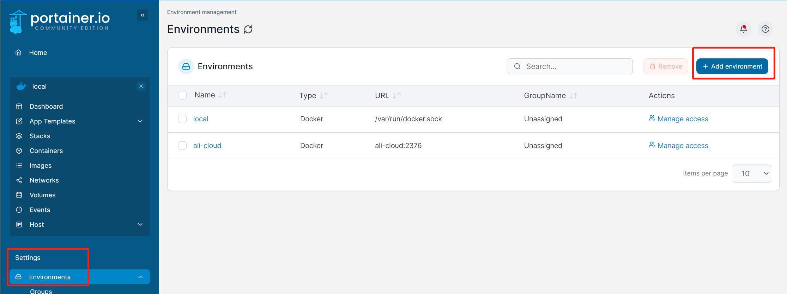
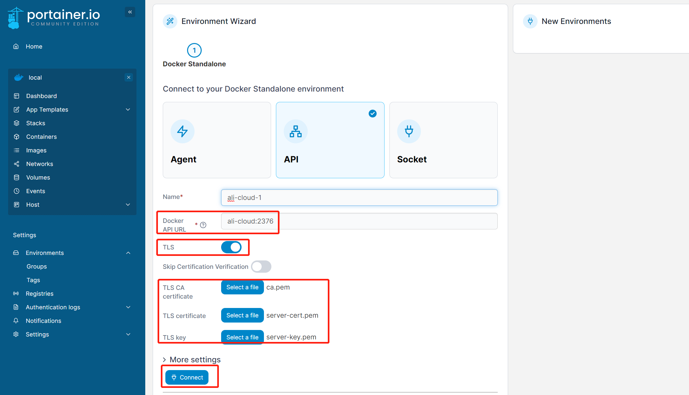

# Portainer TLS connect to remote env <Badge text="Portainer" type="warning" />

**server**: host that running portainer
**client**: host that to be connected to, which is running docker

# client side config
### Create CA in client
1. create root certificate
```bash
openssl genrsa -aes256 -out ca-key.pem 4096
openssl req -new -x509 -days 365 -key ca-key.pem -sha256 -subj "/CN=$HOST" -out ca.pem
openssl genrsa -out server-key.pem 4096
```
2. assign CA using root certificate
```bash
openssl req -new -sha256 \
    -key server-key.pem \
    -subj "/C=CN/OU=$ORG/O=$COMP/CN=$NAME" \
    -reqexts SAN \
    -config <(cat /etc/ssl/openssl.cnf \
        <(printf "\n[SAN]\nsubjectAltName=DNS:$HOST1,DNS:$HOST2")) \
    -out server.csr
```

```bash
openssl x509 -req -days 365 \
    -in server.csr -out server-cert.pem \
    -CA ca.pem -CAkey ca-key.pem -CAcreateserial \
    -extensions SAN \
    -extfile <(cat /etc/ssl/openssl.cnf <(printf "[SAN]\nsubjectAltName=DNS:ali-cloud,DNS:$HOST2"))
```
feel free to change HOST, ORG, COMP and NAME to anything you like. For demo purpose, we use **ali-cloud** as $HOST value
***P.S.*** if you has sub-domain, you can set $HOST to *.domain.com

***P.S.***
<font color=red>/etc/ssl/openssl.cnf</font> might be found from different directory, use following command to find the right location
```bash
find / -name openssl.cnf
```

3. verify certificates
```bash
openssl x509 -noout -text -in server-cert.pem
```

4. config client docker service connection methods
```bash
# /usr/lib/systemd/system/docker.service
# ExecStart=/usr/bin/dockerd -H fd:// --containerd=/run/containerd/containerd.sock
ExecStart=/usr/bin/dockerd \
--tlsverify \
--tlscacert=/root/portainer/ca.pem \
--tlscert=/root/portainer/server-cert.pem \
--tlskey=/root/portainer/server-key.pem \
-H tcp://0.0.0.0:2376 \
-H unix:///var/run/docker.sock
```

5. restart docker
```bash
systemctl daemon-reload && systemctl restart docker
```

***P.S.*** remember to open port 2376 on client host

----
# server side config
1. open portainer UI, add new environment, select docker standalone then select api connection

2. enable tls, upload ca files of client host, then click connect.
***P.S.*** remember to add host in server hosts file. e.g. point ali-cloud to actual client host ip

