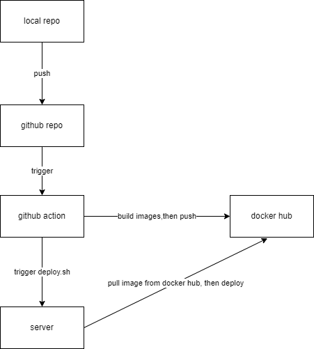

# Config Github Action for CI/CD

## Background
Using github action to automate CI/CD process


## Concepts
##### jobs
Jobs, by default, is running in parallel, but its dependencies can be configured so that jobs can be run in orders.
Jobs, indeed, is a set of steps.

##### steps
Steps existed inside jobs, which running in sequences.
A step can be a set of shell scripts that running in orders,
or an action
p.s. steps shared data since they run on same runner

##### action
Action is a set of customized steps, which includes outputs and inputs. THe main purpose is to reduce duplicated steps in a job.

##### strategy & matrix
Same job will be run multiple time on each matrix params
e.g.
```yaml
strategy:
      matrix:
        node-version: [17.5.0, 16.0.1]
        go-version: [1.18,1,19]
```
this job will run 4 times, on each node&go version combinations

## Config
```yaml
name: blog-ci #
run-name: github.env --- ${{ github.env }}
on:
  push: # "push to ci branch" event will trigger the action
    branches: ['ci']
  workflow_dispatch:   # manually trigger the github action
    inputs:
      version: # can be use as env variables as ${{ inputs.version }}
        description: "choose a version to deploy"
        required: true
        type: string
jobs:
  ci:
    runs-on: ubuntu-latest
    strategy:
      matrix:
        node-version: [17.5.0]
        go-version: [1.18]  # usage: ${{ matrix.go-version }}
    env:
    # env defined here can be shared by all steps inside same job. If env defined inside a step, then that variable only available inside that step
      HOST: ${{ secrets.HOST}} # usage: $Host
      USER: ${{ secrets.USER}}
      KEY: ${{ secrets.SSH_PRIVATE_KEY}}
    steps:
      -
        name: docker login
        uses: docker/login-action@v2 # use customized action
        with: # input of action
          username: ${{ secrets.DOCKERHUB_USER }} # secrets of repo, set on github web UI
          password: ${{ secrets.DOCKERHUB_ACCESS_TOKEN }}

      - name: add ssh host
        shell: bash
        run: |
          mkdir -p ~/.ssh/ && echo "$KEY" > ~/.ssh/id_rsa && chmod 600 ~/.ssh/id_rsa
          cat >>~/.ssh/config <<END
          Host server
            HostName $HOST
            User $USER
            IdentityFile ~/.ssh/id_rsa
            StrictHostKeyChecking no
          END
          ssh-keyscan github.com >> ~/.ssh/known_hosts
          scp server:/root/test.md ./
          cat ./test.md
          # ssh -T server

      - name: Checkout branch
        uses: actions/checkout@v2

      - name: Use Node.js ${{ matrix.node-version }}
        uses: actions/setup-node@v2.1.2
        with:
          node-version: ${{ matrix.node-version }}

      - name: Use Go ${{ matrix.go-version }}
        uses: actions/setup-go@v1
        with:
          go-version: ${{ matrix.go-version }}
      - name: scp config files
        run: |
          scp server:/root/docker/blog/server/config.yml ./server/
          scp server:/root/docker/blog/web/.env ./web/

      - name: build frontend images
        run: |
          cd ./web
          npm install
          npm run build
          docker build -t nuodi/blog-web:latest .
          docker push nuodi/blog-web:latest

      - name: build backend images
        run: |
          cd ./server
          go get -v -t -d ./...
          docker build -t nuodi/blog-server:latest .
          docker push nuodi/blog-server:latest

      - name: deploy
        run: |
          ssh -T server "docker login -u ${{ secrets.DOCKERHUB_USER }} -p ${{ secrets.DOCKERHUB_ACCESS_TOKEN }} && /root/deploy.sh"
```

P.S.
1. In each step, it's like open a new terminal, pwd will be reset to /home/runner/work/repo-name

2. when ssh to a remote server in a step, it only valid for the current line of script. e.g.
```yaml
run: |
  ssh -T server "docker login -u ${{ secrets.DOCKERHUB_USER }} -p ${{ secrets.DOCKERHUB_ACCESS_TOKEN }} && /root/deploy.sh"
  pwd
```
the <a>pwd</a> cmd will not execute on remote server, instead it will return runner's pwd