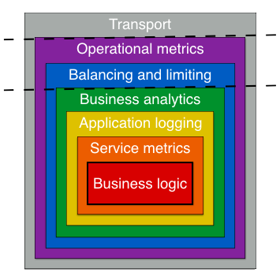

# GoKit Intro <Badge text="GoKit" type="warning" />

### Layout

explain:
when req comes in, it first go through transport layer, which can take rpc, http or gRPC calls, decode request and pass the request through multiple middlewares, such as metrics, load balance/rate limiter, logger tools, etc... and finally routed to a endpoint which call the service which contains business logics.

a typical main.go in go kit is large, and may like this:
```go
logger := log.NewLogger(...)

var service todo.Service    // interface
service = todo.NewService() // concrete struct
service = todo.NewLoggingMiddleware(logger)(service)

endpoints := todo.NewEndpoints(service)
transport := todo.NewHTTPTransport(endpoints)
```
where endpoints act as an action/handler to route the req to service which contains business logics.

p.s. if you implement two transports(http and gRPC), you might have two methods of sending requests to the same endpoint.

### Errors handling
option1: have an error field in your response struct and return business domain errors there
option2: return business domain errors in the endpoint error return value.

Both methods can be made to work. But errors returned directly by endpoints are recognized by middlewares that check for failures, like circuit breakers. It’s unlikely that a business-domain error from your service should cause a circuit breaker to trip in a client. So, it’s likely that you want to encode errors in your response struct.

### Supported 3rd party tools/platforms
- transport protocol: http, gRPC, net/rpc, Thrift
- service discovery: consul, etcd, zookeeper
- observability: Prometheus(recommend), InfluxDB

### Panics handling
Once panic happened, you should allow them to crash your program or handler goroutine, and return a broken response to the calling client. So observability will notice the panic and alert you to fix them ASAP

But if you want to handle exceptions, best practice is to wrap the concrete transport with a transport-specific middleware that performs a recover.
e.g
```go
var h http.Handler
h = httptransport.NewServer(...)
h = newRecoveringMiddleware(h, ...)
// use h normally
```

### db
db connection is usually required only in your business logic, so you can create a simple persistence layer of db interface like this
```go
type Store interface {
	Insert(Profile) error
	Select(id string) (Profile, error)
	Delete(id string) error
}

type databaseStore struct{ db *sql.DB }

func (s *databaseStore) Insert(p Profile) error            { /* ... */ }
func (s *databaseStore) Select(id string) (Profile, error) { /* ... */ }
func (s *databaseStore) Delete(id string) error            { /* ... */ }
```