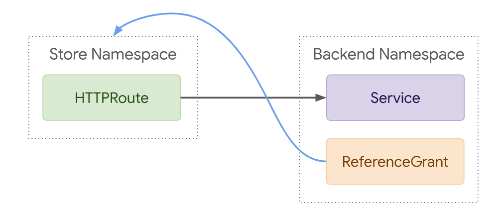

# Consul API Gateway <Badge text="Consul" type="warning" />

## purpose
1. expose api gateway, so traffic will route from gateway to each service. this setup you only need to expose a single api gateway through ingress.
2. gateway can be used as a load balancer to route req to different service based on the weight setting
3. can apply auth by gateway

### implement
##### install
> kubectl apply -f ./consul/api-gateway.yaml
```yaml
apiVersion: gateway.networking.k8s.io/v1beta1
kind: Gateway
metadata:
  name: api-gateway
  namespace: consul
spec:
  gatewayClassName: consul
  listeners:
    # options: HTTP or HTTPS
  - protocol: HTTP
     # options: 80 or 443 or custom
    port: 80
    name: http
    allowedRoutes:
      namespaces:
        # options: All or Same or Specific
        from: All
```
##### create an ingress to expose api gateway
this is the way service api endpoint can be exposed as an gateway endpoint.
```yaml
apiVersion: networking.k8s.io/v1
kind: Ingress
metadata:
  name: consul-api-gateway-ingress
  namespace: consul
  annotations:
    kubernetes.io/ingress.class: nginx
spec:
  ingressClassName: nginx
  rules:
  - host: "consul.api-gateway.local"
    http:
      paths:
      - pathType: Prefix
        path: "/"
        backend:
          service:
            name: api-gateway
            port:
              number: 80

```

##### create an intension and routes
```yaml
# create an intention and two routes
---
apiVersion: consul.hashicorp.com/v1alpha1
kind: ServiceIntentions
metadata:
  name: api-gateway-hashicups
spec:
  destination:
    name: frontend
  sources:
    - name: api-gateway
      action: allow
---
apiVersion: gateway.networking.k8s.io/v1beta1
kind: HTTPRoute
metadata:
  name: route-root
  namespace: default
spec:
  parentRefs:
  - name: api-gateway
    namespace: consul
  rules:
  - matches:
    - path:
        type: PathPrefix
        value: /
    backendRefs:
    - kind: Service
      name: frontend
      port: 3000
---
apiVersion: gateway.networking.k8s.io/v1beta1
kind: HTTPRoute
metadata:
  name: route-hashicups
  namespace: default
spec:
  parentRefs:
  - name: api-gateway
    namespace: consul
  rules:
  - matches:
    - path:
        type: Exact
        value: /hashicups
    backendRefs:
    - kind: Service
      name: frontend
      namespace: default
      port: 3000
    filters:
      - type: URLRewrite
        urlRewrite:
          path:
            replacePrefixMatch: /
            type: ReplacePrefixMatch
```
p.s.
1. notice that you can rewrite url based on matched result.
2. intension is created per service,

e.g. 2 use api gateway as a load balancer
```yaml
---
apiVersion: consul.hashicorp.com/v1alpha1
kind: ServiceIntentions
metadata:
  name: api-gateway-echo-1
spec:
  destination:
    name: echo-1
  sources:
    - name: api-gateway
      action: allow
---
apiVersion: consul.hashicorp.com/v1alpha1
kind: ServiceIntentions
metadata:
  name: api-gateway-echo-2
spec:
  destination:
    name: echo-2
  sources:
    - name: api-gateway
      action: allow
---
apiVersion: gateway.networking.k8s.io/v1beta1
kind: HTTPRoute
metadata:
  name: route-echo
  namespace: default
spec:
  parentRefs:
  - name: api-gateway
    namespace: consul
  rules:
  - matches:
    - path:
        type: PathPrefix
        value: /echo
    backendRefs:
    - kind: Service
      name: echo-1
      port: 8080
      weight: 50
    - kind: Service
      name: echo-2
      port: 8090
      weight: 50
```
p.s. the HTTPRoute you created should be in the same namespace with your backendRefs, otherwise you need to add a ReferenceGrant and specific namespace of your backend service in backendRefs block.
e.g.

```yaml
# create an intention and two routes
---
apiVersion: consul.hashicorp.com/v1alpha1
kind: ServiceIntentions
metadata:
  name: api-gateway-hashicups
spec:
  destination:
    name: frontend
  sources:
    - name: api-gateway
      action: allow
---
apiVersion: gateway.networking.k8s.io/v1beta1
kind: HTTPRoute
metadata:
  name: route-root
  namespace: consul
spec:
  parentRefs:
  - name: api-gateway
    namespace: consul
  rules:
  - matches:
    - path:
        type: PathPrefix
        value: /
    backendRefs:
    - kind: Service
      name: frontend
      namespace: default
      port: 3000
---
apiVersion: gateway.networking.k8s.io/v1beta1
kind: HTTPRoute
metadata:
  name: route-hashicups
  namespace: consul
spec:
  parentRefs:
  - name: api-gateway
    namespace: consul
  rules:
  - matches:
    - path:
        type: Exact
        value: /hashicups
    backendRefs:
    - kind: Service
      name: frontend
      namespace: default
      port: 3000
    filters:
      - type: URLRewrite
        urlRewrite:
          path:
            replacePrefixMatch: /
            type: ReplacePrefixMatch
---
apiVersion: gateway.networking.k8s.io/v1alpha2
kind: ReferenceGrant
metadata:
  name: reference-grant
  namespace: default
spec:
  from:
  - group: gateway.networking.k8s.io
    kind: HTTPRoute
    namespace: consul
  to:
  - group: ""
    kind: Service
    name: frontend
```
ReferenceGrant to block service has to be in same namespace of this ReferenceGrant (so you don't specify namespace in to block)



p.s.3 you can delete a HTTPRoute resource by
> kubectl get httproutes -n namespace
> kubectl delete httproute http-route-name -n namespace