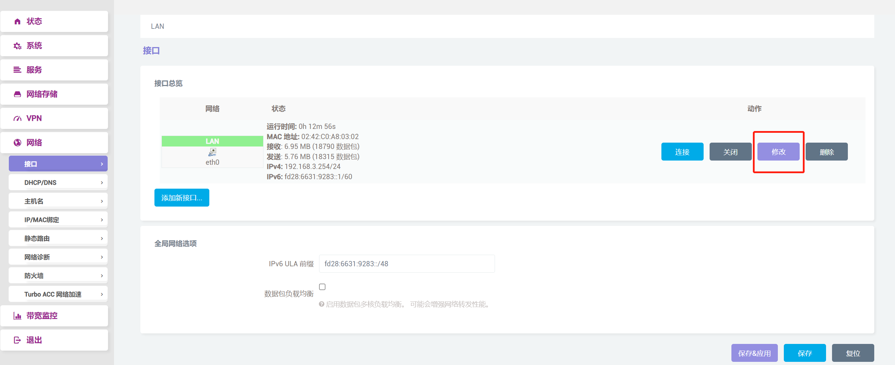
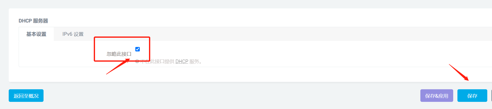
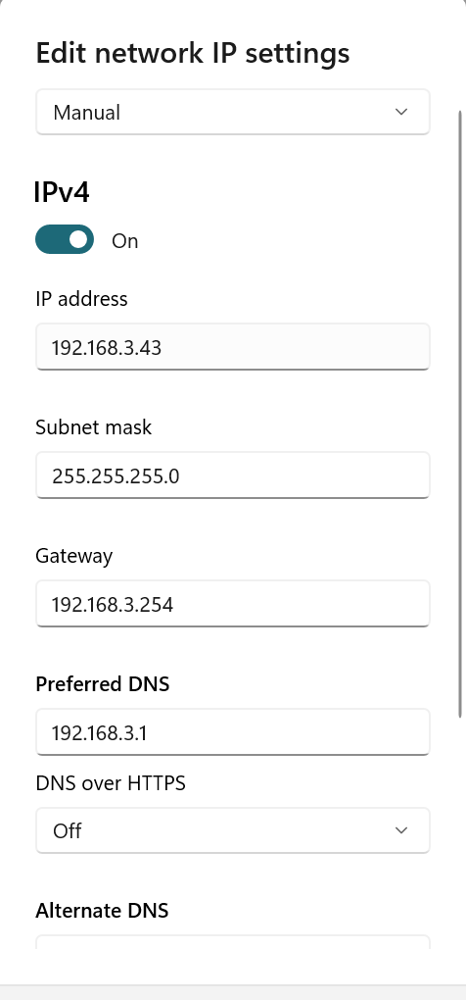

# Install OpenWrt bypass in docker <Badge text="OpenWrt" type="warning" />

##### 开启此网卡混杂模式
```bash
#
# eth0 is the network interface of the hardware
ip link set eth0 promisc on

# set MACVLAN
docker network create -d macvlan --subnet=192.168.3.0/24 --gateway=192.168.3.1 -o parent=eth0 macnet
```
-d 指定 Docker 网络 driver
--subnet 指定 macvlan 网络所在的网络
--gateway 指定网关
-o parent 指定用来分配 macvlan 网络的物理网卡
macnet: name of macvlan

<br/>
##### pull the right image based on arch of hardware, then run the image in docker
```bash
docker run --restart always --name openwrt -d --network macnet --ip 192.168.3.254 --privileged buddyfly/openwrt-aarch64:latest /sbin/init
```
-d: run in background
--privileged: assign system privilege to the container
/sbin/init: auto run the init script after container started

<br/>
##### enter the container and change lan config

```yml
# /etc/config/network
config interface 'lan'
        option type 'bridge'
        option ifname 'eth0'
        option proto 'static'
        option ipaddr '192.168.3.254'
        option netmask '255.255.255.0'
        option ip6assign '60'
        option gateway '192.168.3.1'
        option broadcast '192.168.3.255'
        option dns '192.168.3.1'
```
ipaddr: ip of your hardware
gateway: ip of your main router
dns: ip for your main router

***P.S***
remember to add fixed ip for your hardware in main router
<br/>
##### restart network card, then you can visit openwrt portal at ipaddr
```bash
/etc/init.d/network restart
```
<br/>

##### login to the ip of your target ipaddr using:

name: **root**
password: **password**

- edit lan

- turn off dhcp (make sure dhcp is turned on in your main router)

- connect your device to the main router manually, set gateway to ipaddr and dns to your main router ip (also remember to **fix your device ip** in main router)


### change source
```bash
src/gz openwrt_core https://mirrors.aliyun.com/openwrt/releases/22.03.0-rc6/targets/armvirt/64/packages/
src/gz openwrt_base https://mirrors.aliyun.com/openwrt/releases/22.03.0-rc6/packages/aarch64_cortex-a53/base
src/gz openwrt_luci https://mirrors.aliyun.com/openwrt/releases/22.03.0-rc6/packages/aarch64_cortex-a53/luci
src/gz openwrt_packages https://mirrors.aliyun.com/openwrt/releases/22.03.0-rc6/packages/aarch64_cortex-a53/packages
src/gz openwrt_routing https://mirrors.aliyun.com/openwrt/releases/22.03.0-rc6/packages/aarch64_cortex-a53/routing
src/gz openwrt_telephony https://mirrors.aliyun.com/openwrt/releases/22.03.0-rc6/packages/aarch64_cortex-a53/telephony

```