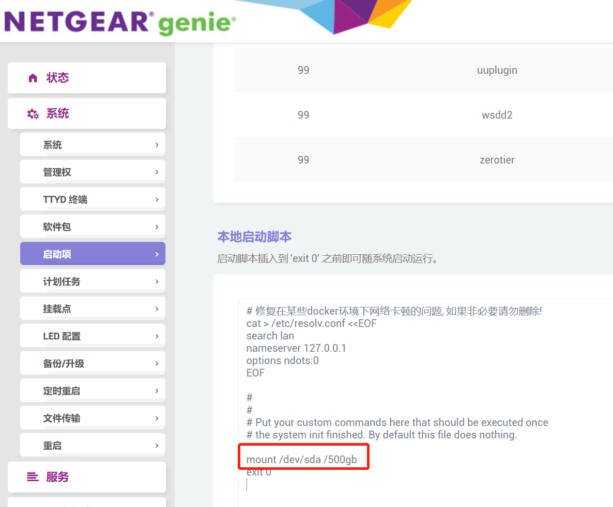
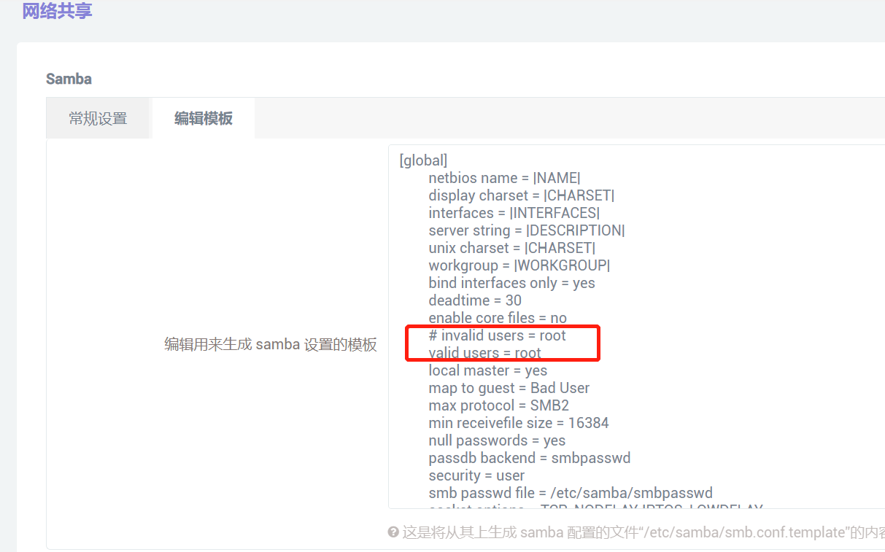
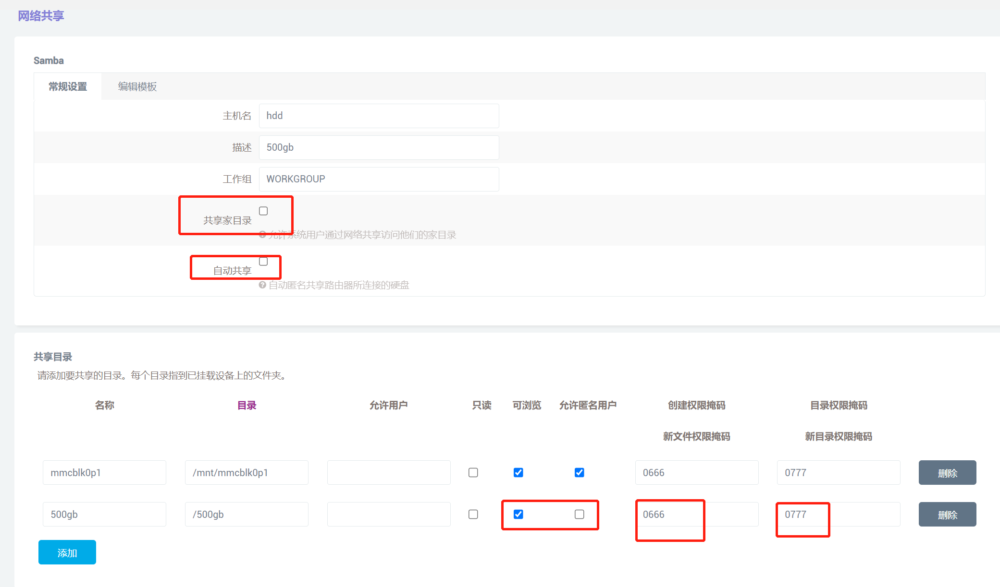

# Mount ext4 harddisk to openwrt in docker <Badge text="OpenWrt" type="warning" />

### Purpose
After replacing a 500GB HDD with SSD on my thinkpad x260 (so I can run win10 on my old pal), I plan to use mount this HDD to my raspberry pi to build a NAS. In order to extent its life span, I need to control its sleep-awake status by openwrt (running in docker)

##### use cfdisk & mkfs.ext4 to format HDD into s linux file system
Usually, HDD is in nfts format, so first we need to convert it to ext4 by using cfdisk and mkfs.ext4
```bash
# find name of HDD
fdisk -l

# use cfdisk to delete all volume of HDD, then create a new volume with whole size of HDD
cfdisk /dev/sda

# convert to ext4 format
mkfs.ext4 /dev/sda
```

##### mount the HDD in openwrt container
```bash
# enter container
sudo docker exec -it openwrt sh

# create mount dir
mkdir hdd
chmod 777 hdd

# since container has Pi OS privilege, it can detect /dev/sda
# should also add this in init script
mount /deb/sda /hdd
```

now you should be able see the mounted hdd in network panel


##### config smb for attached HDD
1. comment out invalid user and then add the attached HDD
```bash
# invalid users = root
```


2. config samba


3. enter the container, set password for samba root user
```bash
 smbpasswd -a root
```

Now you can map your driver in windows