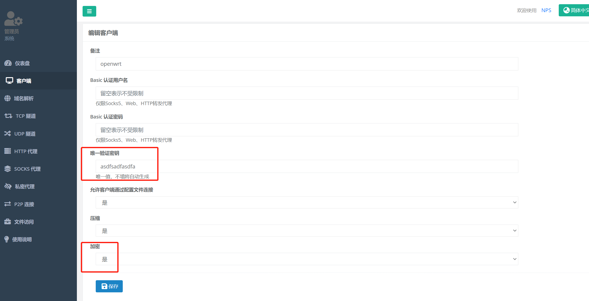
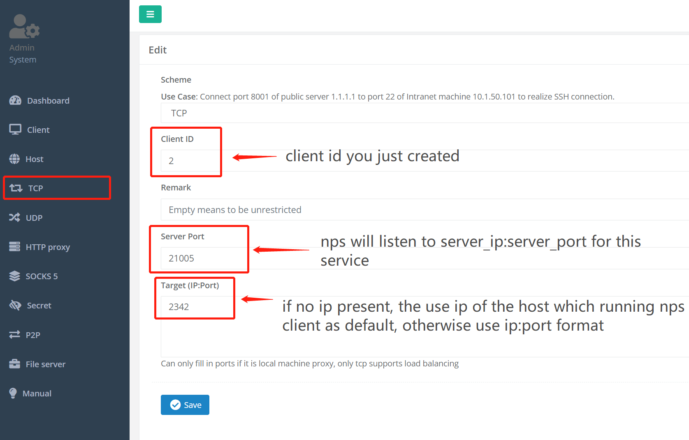
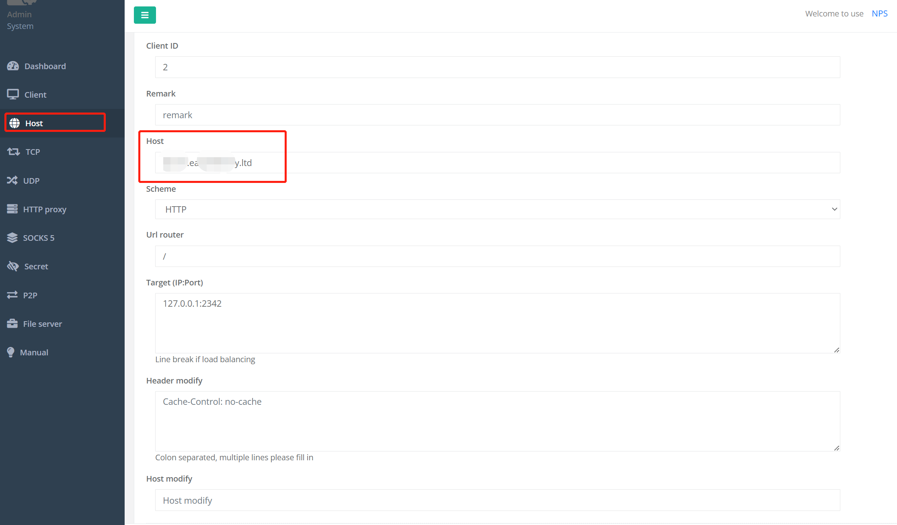
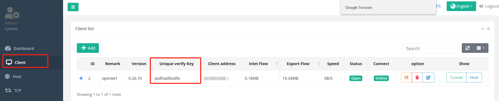

# NPS Usage <Badge text="NPS" type="warning" />

### Purpose:
Use server's public ip and domain to forward request to services running on home PC.

***e.g.*** visit photoprism service that running on local raspberry pi using cloud server ip+port or domain+port.

### Approach:
install nps client and server on target hosts to build a trunnel for intranet penetration

----------------------

#### server side
1. download nps server install pkg from <a>https://github.com/ehang-io/nps/releases</a>

2. unzip pkg and run install script
```bash
tar -zxvf linux_amd64_server.tar.gz

```
3. edit config file in /etc/nps/conf
```bash
# /etc/nps/conf/nps.conf

#HTTP(S) proxy port, no startup if empty
http_proxy_port=20080 # so nps won't block normal 80 & 443 port
https_proxy_port=20443

##bridge
bridge_type=tcp
bridge_port=8024
bridge_ip=0.0.0.0

#web
web_username=admin
web_password=123qwe
web_port=8080 # port of web admin portal
```

4. start nps
```bash
nohup ./nps start  >/dev/null 2>&1 &
```
5. login web portal, add a client


6. add a tcp tunnel, so client_ip:target_port will be mapped to  server_ip:server_port



7. if you have a domain that you want to build a tunnel on domain:port instead of server_up:port, you can add a Host



***p.s.***
remember to open port 8080 (web portal), 8024 (bridge port), in your cloud server, 21005 (tcp tunnel port) on server side and 2342 (client service running port) on client side

----

#### client side
1. download nps client pkg and unzip pkg, similarly to the server side

2. start nps client
```bash
nohup ./npc -server=server_ip:8024 -vkey=unique_verify_key  >/dev/null 2>&1 &
```



### Done
now you can visit home service with your domain:ip