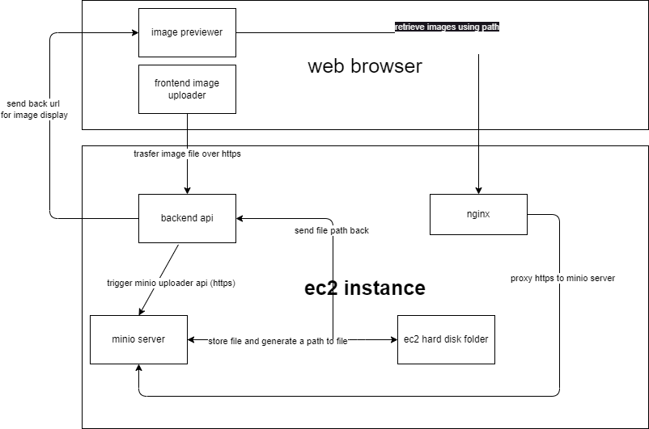
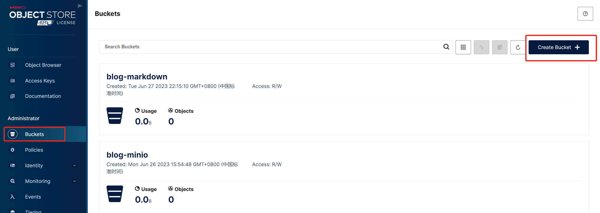
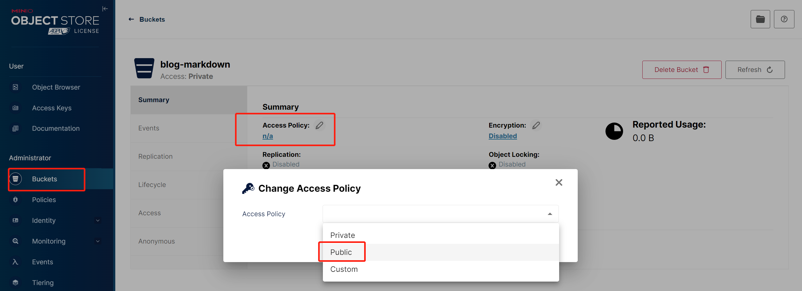

# Deploy MinIO using Docker to provide image hosting service <Badge text="MinIO" type="warning" />

### Purpose:
Use MinIO to host images uploading and downloading.

#### topology


Details:
1. frontend file uploader send a multipart/form-data https request to backend api
2. backend api received file and upload file to minio server using minio client api
3. after uploading success, minio will return file path as callback, then frontend can serve image using that path
4. I used an extra nginx here because I don't want to expose my ip+port in the image retrieve url, so that nginx will proxy image retrieve url (https://second.domain) to minio server(http://ip:port)

1. deploy MinIO using docker-compose
```yml
version: '3'
services:
  minio:
    image: minio/minio:latest
    container_name: blog_minio
    ports:
      - "3050:3050" # service api port, also used for health check
      - "3060:3060" # manage portal port
    restart: always
    volumes:
      - ./data/:/data/ # mapping of data storage directory
      - ./config/:/root/.minio # configs path
    environment:
    - MINIO_ROOT_USER=${MINIO_ROOT_USER} # login name and password from env variable
    - MINIO_ROOT_PASSWORD=${MINIO_ROOT_PASSWORD}
    command: server /data --console-address ":3060" --address ":3050"
    healthcheck:
      test: ["CMD", "curl", "-f", "http://localhost:3050/minio/health/live"]
      interval: 30s
      timeout: 20s
      retries: 3
```
2. log in the portal and create a bucket


3. edit bucket policy, make it public and we done minio side config


4. frontend file uploader
```js
const uploadImg = async(files, callback) => {
  const forms = new FormData()
  forms.append('file', files[0])
  const { data: res } = await postUploadFile(
    forms,
    {
      'Content-Type': 'multipart/form-data'
    }
  )
  console.log('-----res-----', res)
  callback([res.data.url]) // return url
}
```
then set request header in axio request interceptors
```js
apiAxios.interceptors.request.use(config => {
  if (config['Content-Type']) {
    config.headers['Content-Type'] = config['Content-Type']
  } else {
    config.headers['Content-Type'] = 'application/json;charset=UTF-8'
  }
  ...
})
```

5. backend api
```go
//api
func (oa *OssApi) Uploader(c *gin.Context) {
	_, header, err := c.Request.FormFile("file")
	if err != nil {
		global.LOGGER.Error("Fail to receive file", zap.Error(err))
		response.FailWithMessage("Fail to receive file", c)
		return
	}
	filePath, err := ossService.UploadFile(header) // 文件上传后拿到文件路径
	if err != nil {
		global.LOGGER.Error("fail to add file path to DB!", zap.Error(err))
		response.FailWithMessage("fail to add file path to DB", c)
		return
	}
	response.OkWithFullDetails(response.UploadFileResult{Url: filePath}, "success", c)
}

//service
func (os *OssService) UploadFile(header *multipart.FileHeader) (path string, err error) {
	oss := upload.NewOss()
	path, err = oss.UploadFile(header)
	if err != nil {
		panic(err)
	}
	return path, err
}

//trigger minio server api
func (*Minio) UploadFile(file *multipart.FileHeader) (string, error) {
	config := global.CONFIG.Minio{
    Port: 3050
    Host: "blog.easydelivery.ltd"
    Username: "xxxadmin"
    Password: "xxxxxx"
    Bucket: "xxxxx" //bucket name you just created on portal
    Region: "cn"
    Https: false //whether to use https
  }
	minioClient := newClient()
	filename := fmt.Sprintf("%d%s", time.Now().Unix(), file.Filename)
	f, openError := file.Open()
	if openError != nil {
		global.LOGGER.Error("function file.Open() Filed", zap.Error(openError))
		return "", errors.New("function file.Open() Filed, err:" + openError.Error())
	}
	defer f.Close() // 创建文件 defer 关闭
	opts := minio.PutObjectOptions{ContentType: "application/octet-stream"}
	uploadInfo, err := minioClient.PutObject(context.Background(), config.Bucket, filename, f, file.Size, opts)
	if err != nil {
		global.LOGGER.Error("function uploader.Upload() Filed", zap.Error(err))
		return "", err
	}
	url := "https://" + config.Host + "/minio/" + config.Bucket + "/" + uploadInfo.Key
	return url, nil
}

func newClient() *minio.Client {
  config := global.CONFIG.Minio{
    Port: 3050
    Host: "blog.easydelivery.ltd"
    Username: "xxxadmin"
    Password: "xxxxxx"
    Bucket: "xxxxx" //bucket name you just created on portal
    Region: "cn"
    Https: false //whether to use https
  }
	minioClient, err := minio.New(config.Host+":"+config.Port, &minio.Options{
		Creds:  credentials.NewStaticV4(config.Username, config.Password, ""),
		Secure: config.Https,
	})
	if err != nil {
		global.LOGGER.Error("fail to init minio client", zap.Error(err))
	}

	// Make a new bucket.
	bucketName := config.Bucket
	region := config.Region

	ctx := context.Background()
	err = minioClient.MakeBucket(ctx, bucketName, minio.MakeBucketOptions{Region: region})
	if err != nil {
		// Check to see if we already own this bucket (which happens if you run this twice)
		exists, errBucketExists := minioClient.BucketExists(ctx, bucketName)
		if errBucketExists == nil && exists {
			global.LOGGER.Info(fmt.Sprintf("We already own %s\n", bucketName))
			return minioClient
		} else {
			global.LOGGER.Error("fail to find bucket", zap.Error(err))
			return nil
		}
	} else {
		return minioClient
	}
}
```

6. nginx config
```nginx
# load balance
upstream blog_minio {
  server blog.easydelivery.ltd:3050;
}

# log config
log_format  blog_log  'remote_addr: $remote_addr '
                      'remote_user: $remote_user '
                      'X-Forwarded-Proto $scheme '
                      'Host $http_host '
                      'http_x_forwarded_for: $http_x_forwarded_for';

server {
  listen 80;
  listen [::]:80;

  #将 http 重定向 https
  return 301 https://$server_name$request_uri;
}

# ssl verification related config
ssl_session_timeout  5m;    #缓存有效期
ssl_ciphers ECDHE-RSA-AES128-GCM-SHA256:ECDHE:ECDH:AES:HIGH:!NULL:!aNULL:!MD5:!ADH:!RC4;    #encrypt algorithm
ssl_protocols TLSv1 TLSv1.1 TLSv1.2;    #安全链接可选的加密协议
ssl_prefer_server_ciphers on;   #使用服务器端的首选算法

#https
server {
  listen 443 ssl;
  server_name         blog.easydelivery.ltd;
  ssl_certificate     /etc/nginx/cert/blog.easydelivery.ltd.pem;
  ssl_certificate_key /etc/nginx/cert/blog.easydelivery.ltd.key;

  # $http_host is blog.easydelivery.ltd in this case
  proxy_set_header Host $http_host;

  # customized header should always start with x

  # $remote_addr is the client ip where request was sent from
  proxy_set_header  X-Real-IP $remote_addr;

  # if the request go through multiple proxy, we use $proxy_add_x_forwarded_for to track each proxy ip, so we can obtain the whole chain of proxy path, start from origin client ip from left, followed by each proxy ip request passed through
  proxy_set_header X-Forwarded-For $proxy_add_x_forwarded_for;

  # $scheme is https in this case.
  # this header only useful if we want to identify the origin request is http or https
  proxy_set_header X-Forwarded-Proto $scheme;

  # output access_log to logs/blog-web.log, with log format blog_log configured above. Remember to map the log file location if you are using docker containers.
  access_log  logs/blog-web.log blog_log;

  location /minio/ {
    proxy_pass http://blog_minio/; # forward request using http
    # e.g.
    # https://blog.easydelivery.ltd/minio/bucket-name/image-path.png config.Bucket + "/" + uploadInfo.Key will be forwarded as
    # http://blog.easydelivery.ltd:3050/bucket-name/image-path.png
  }
}

```