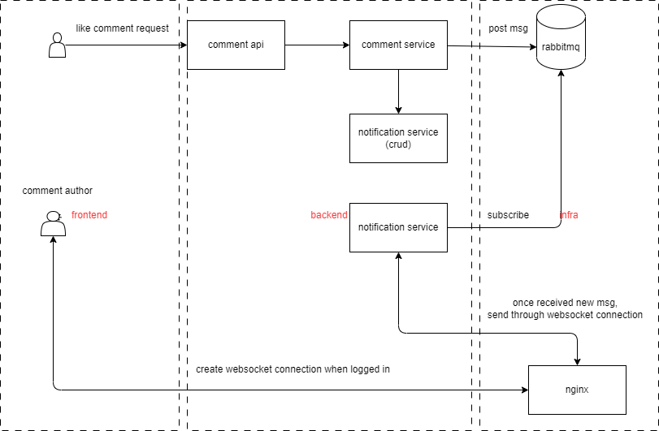

# Implement Notification System <Badge text="Websocket" type="warning" />

### Purpose:
When users interact with others, such as liking a comment or write a reply, the notification system is used to notify the assets owner (post author, comment author, etc..) in real time.



##### Step 1:  deploy rabbitmq using docker-compose
compose file:
```yml
version: '3'

services:
  rabbitmq:
    image: rabbitmq:3-management
    ports:
      - "5671:5671" # with tls
      - "5672:5672" # without tls
      - "15672:15672" # management portal
      - "1883:1883" # mqtt plugin port
      - "8883:8883" # mqtt plugin with TLS port
    command: "/bin/bash -c \"rabbitmq-plugins enable --offline rabbitmq_management rabbitmq_mqtt rabbitmq_web_mqtt rabbitmq_amqp1_0; rabbitmq-server\""
    volumes:
      - rabbitmq_data:/var/lib/rabbitmq
      - ./rabbitmq.conf:/etc/rabbitmq/conf.d/10-defaults.conf
      # - ./rabbitmq.conf:/etc/rabbitmq/rabbitmq.conf

      # tls certificate
      - ./cert/:/cert/
    environment:
      RABBITMQ_DEFAULT_USER: xxx
      RABBITMQ_DEFAULT_PASS: xxxxxx
    privileged: true

volumes:
  rabbitmq_data:
```
config file:
```sh
## DEFAULT SETTINGS ARE NOT MEANT TO BE TAKEN STRAIGHT INTO PRODUCTION
## see https://www.rabbitmq.com/configure.html for further information
## on configuring RabbitMQ

## allow access to the guest user from anywhere on the network
## https://www.rabbitmq.com/access-control.html#loopback-users
## https://www.rabbitmq.com/production-checklist.html#users
loopback_users.guest = false

## Send all logs to stdout/TTY. Necessary to see logs when running via
## a container
log.console = true

# listeners.tcp.default = 5672
listeners.tcp.1 = 0.0.0.0:5672


# =======================================
# MQTT section
# =======================================

## TCP listener settings.
##
# mqtt.listeners.tcp.1 = 127.0.0.1:61613
# mqtt.listeners.tcp.2 = ::1:61613
mqtt.listeners.tcp.1 = 0.0.0.0:1883

## TCP listener options (as per the broker configuration).
##
# mqtt.tcp_listen_options.backlog = 4096
# mqtt.tcp_listen_options.recbuf  = 131072
# mqtt.tcp_listen_options.sndbuf  = 131072
# #
# mqtt.tcp_listen_options.keepalive = true
# mqtt.tcp_listen_options.nodelay   = true
# #
# mqtt.tcp_listen_options.exit_on_close = true
# mqtt.tcp_listen_options.send_timeout  = 120000

## TLS listener settings
## ## See https://rabbitmq.com/mqtt.html and https://rabbitmq.com/ssl.html for details.
#
# mqtt.listeners.ssl.default = 8883
#
# ssl_options.cacertfile = /cert/blog.easydelivery.ltd_chain.crt
# ssl_options.certfile   = /cert/blog.easydelivery.ltd_public.crt
# ssl_options.keyfile    = /cert/blog.easydelivery.ltd.key
# ssl_options.verify     = verify_peer
# ssl_options.fail_if_no_peer_cert  = true
#


## Number of Erlang processes that will accept connections for the TCP
## and TLS listeners.
##
mqtt.num_acceptors.tcp = 10
mqtt.num_acceptors.ssl = 10

## Whether or not to enable proxy protocol support.
## Once enabled, clients cannot directly connect to the broker
## anymore. They must connect through a load balancer that sends the
## proxy protocol header to the broker at connection time.
## This setting applies only to STOMP clients, other protocols
## like STOMP or AMQP have their own setting to enable proxy protocol.
## See the plugins or broker documentation for more information.
##
# mqtt.proxy_protocol = false

## Set the default user name and password used for anonymous connections (when client
## provides no credentials). Anonymous connections are highly discouraged!
##
# mqtt.default_user = admin
# mqtt.default_pass = instar

## Enable anonymous connections. If this is set to false, clients MUST provide
## credentials in order to connect. See also the mqtt.default_user/mqtt.default_pass
## keys. Anonymous connections are highly discouraged!
##
mqtt.allow_anonymous = false

## If you have multiple vhosts, specify the one to which the
## adapter connects.
##
# mqtt.vhost = /

## Specify the exchange to which messages from MQTT clients are published.
##
# mqtt.exchange = amq.topic

## Specify TTL (time to live) to control the lifetime of non-clean sessions.
##
mqtt.subscription_ttl = 1800000

## Set the prefetch count (governing the maximum number of unacknowledged
## messages that will be delivered).
##
mqtt.prefetch = 10

## Sets the durable queue type to be used for QoS 1 subscriptions.
##
## Supported types are:
##
## * classic
## * quorum
##
## IMPORTANT: changing this setting requires all existing queues used by
## the MQTT plugin to be DELETED or clients will fail to subscribe.
## So this setting should be used for new clusters.
##
mqtt.durable_queue_type = classic
#
```

##### Step 2:  config nginx to proxy websocket to backend service

All my websocket request is prefixed with /websocket.
> e.g. ws://host:ip/websocket/xxx

So in dev vite server, I use vite proxy like this:
```js
server = {
  port: ENV.VITE_APP_PORT,
  host: ENV.VITE_APP_HOST,
  proxy: {
    '/websocket': {
      target: ENV.VITE_WEBSOCKET_LOCAL,
      changeOrigin: true,
      rewrite: (path) => path.replace(/^\/websocket/, ''),
      ws: true,
    }
  }
```

Since I have two layers of nginx (in order to use subdomains), websocket config should be configured in both nginx.

***first nginx(outer one)***
```nginx
# load balance
upstream blog_server {
  server blog.easydelivery.ltd:3040;
}

upstream blog_websocket {
  server blog.easydelivery.ltd:3040;
}

# log config
log_format  blog_log  'remote_addr: $remote_addr '
                      'remote_user: $remote_user '
                      'X-Forwarded-Proto $scheme '
                      'Host $http_host '
                      'http_x_forwarded_for: $http_x_forwarded_for'
                      '$remote_addr - $remote_user [$time_local] "$request" $status $body_bytes_sent "*"';

server {
  listen 80;
  listen [::]:80;
  root /var/www/dist-1.12/;
  index index.html;
  server_name         www.easydelivery.ltd;

  #将 http 重定向 https
  return 301 https://$server_name$request_uri;
}

# ssl verification related config
ssl_session_timeout  5m;    #缓存有效期
ssl_ciphers ECDHE-RSA-AES128-GCM-SHA256:ECDHE:ECDH:AES:HIGH:!NULL:!aNULL:!MD5:!ADH:!RC4;    #encrypt algorithm
ssl_protocols TLSv1 TLSv1.1 TLSv1.2;    #安全链接可选的加密协议
ssl_prefer_server_ciphers on;   #使用服务器端的首选算法

server {
  listen 443 ssl;
  server_name         blog.easydelivery.ltd;
  ssl_certificate     /etc/nginx/cert/blog.easydelivery.ltd.pem;
  ssl_certificate_key /etc/nginx/cert/blog.easydelivery.ltd.key;

  # $http_host is blog.easydelivery.ltd in this case
  proxy_set_header Host $http_host;

  # customized header should always start with x

  # $remote_addr is the client ip where request was sent from
  proxy_set_header  X-Real-IP $remote_addr;

  # if the request go through multiple proxy, we use $proxy_add_x_forwarded_for to track each proxy ip, so we can obtain the whole chain of proxy path, start from origin client ip from left, followed by each proxy ip request passed through
  proxy_set_header X-Forwarded-For $proxy_add_x_forwarded_for;

  # $scheme is https in this case.
  # this header only useful if we want to identify the origin request is http or https
  proxy_set_header X-Forwarded-Proto $scheme;

  # output access_log to logs/blog-web.log, with log format blog_log configured above. Remember to map the log file location if you are using docker containers.
  access_log  logs/blog-web.log blog_log;

  location / {
    proxy_pass https://blog_server; # 设置代理服务器的协议和地址
  }

  location /websocket/ {
    proxy_pass https://blog_websocket; # 设置代理服务器的协议和地址
    proxy_http_version 1.1;
    proxy_set_header Upgrade $http_upgrade;
    proxy_set_header Connection "Upgrade";
  }
}
```

***second nginx(inner one)***

```nginx
  log_format  dd  'remote_addr: $remote_addr '
                  'remote_user: $remote_user '
                  'X-Forwarded-Proto $scheme '
                  'Host $http_host '
                  'X-Real-IP: $http_x_real_ip '
                  'Cookie $http_Cookie '
                  'proxy_add_x_forwarded_for: $proxy_add_x_forwarded_for'
                  '$remote_addr - $remote_user [$time_local] "$request" $status $body_bytes_sent "*"';
#https
server {
  listen 3040 ssl;
  server_name         blog.easydelivery.ltd;
  root /var/www/dist/;
  index index.html;

  gzip on;
  gzip_min_length 1024;
  gzip_comp_level 4;
  gzip_http_version 1.1;
  gzip_types text/plain text/css application/x-javascript application/javascript application/xml application/json;

  ssl_certificate     /etc/nginx/cert/blog.easydelivery.ltd.pem;
  ssl_certificate_key /etc/nginx/cert/blog.easydelivery.ltd.key;


  location /backend/api {
    proxy_set_header X-Forwarded-For $proxy_add_x_forwarded_for;
    # rewrite ^/api/(.*)$ /$1 break;  #重写
    proxy_pass http://blog.easydelivery.ltd:3030/api; # 设置代理服务器的协议和地址
      # proxy_cookie_path  / /blog/api;
      # proxy_cookie_domain blog.easydelivery.ltd xxx.xx.xx.xx;
    access_log  logs/blog-web.log dd;
  }

  location /websocket/api {
    # proxy_set_header X-Forwarded-For $proxy_add_x_forwarded_for;
    proxy_http_version 1.1;
    proxy_set_header Upgrade $http_upgrade;
    proxy_set_header Connection "Upgrade";
    proxy_pass http://blog.easydelivery.ltd:3030/api; # 设置代理服务器的协议和地址
    access_log  logs/blog-web.log dd;
  }

  location / {
    try_files $uri $uri/ /index.html;
  }

  location /swagger/ {
    proxy_pass http://blog.easydelivery.ltd:3030;
  }
}

```

It would be more efficient using one nginx instead of two, since each nginx will have to store the connection info somewhere. Again, I have to use subdomain so I can buy one domain and host multiple websites

##### Step 3:  frontend websocket encapsulation
```js
import { ref } from 'vue'

const defaultOptions = {
  autoReconnect: true,
  heartbeat: true,
  onConnected: (ws) => {},
  onDisconnected: (ws, event) => { },
  onError: (ws, event) => { },
  onFailed: () => { },
  onMessage: (ws, event) => { },
}

const DEFAULT_PING_MESSAGE = 'ping'

export default function useWebsocket(url, options = defaultOptions) {
  let explicitlyClosed = false
  let retried = 0
  const status = ref('CLOSED')
  const wsRef = ref()
  let bufferedData = []
  let heartbeatPause
  let heartbeatResume
  let pongTimeoutWait

  const data = ref(null)

  options = { ...defaultOptions, ...options }
  const {
    onConnected,
    onDisconnected,
    onError,
    onMessage,
    onFailed,
  } = options

  // heartbeat feature
  if (options.heartbeat) {
    const isActive = ref(false) // heartbeat active status
    const message = DEFAULT_PING_MESSAGE
    const interval = 60000 // time interval for heartbeat
    const pongTimeout = 60000 // time to stop waiting pong response

    let _timer = null

    const ping = () => {
      send(message, false)
      if (pongTimeoutWait !== undefined) { return }
      pongTimeoutWait = setTimeout(() => {
        // auto-reconnect will be trigger with ws.onclose()
        close()
        explicitlyClosed = false
      }, pongTimeout)
    }

    heartbeatPause = () => {
      isActive.value = false
      clean()
    }

    heartbeatResume = () => {
      isActive.value = true
      clean()
      _timer = setInterval(ping, interval)
    }

    const clean = () => {
      if (_timer) {
        clearInterval(_timer)
        _timer = null
      }
    }
  }

  const _sendBuffer = () => {
    if (bufferedData.length && wsRef.value && status.value === 'OPEN') {
      for (const buffer of bufferedData) { wsRef.value.send(buffer) }
      bufferedData = []
    }
  }

  const resetHeartbeat = () => {
    clearTimeout(pongTimeoutWait)
    pongTimeoutWait = undefined
  }

  const send = (data, useBuffer = true) => {
    if (!wsRef.value || status.value !== 'OPEN') {
      if (useBuffer) { bufferedData.push(data) }
      console.log('--!wsRef.value || status.value ')
      return false
    }
    _sendBuffer()
    console.log('--wsRef.value----', wsRef.value)
    wsRef.value.send(data)
    return true
  }

  const _init = () => {
    if (explicitlyClosed) { return }
    const ws = new WebSocket(url)
    wsRef.value = ws
    status.value = 'CONNECTING'

    ws.onopen = () => {
      status.value = 'OPEN'
      onConnected?.(ws)
      heartbeatResume?.()
      _sendBuffer()
    }

    ws.onclose = (ev) => {
      status.value = 'CLOSED'
      wsRef.value = undefined
      onDisconnected?.(ws, ev)

      if (!explicitlyClosed && options.autoReconnect) {
        const retries = -1 // infinite retry reconnect
        const delay = 10000
        retried += 1
        if (typeof retries === 'number' && (retries < 0 || retried < retries)) {
          setTimeout(_init, delay)
        } else {
          onFailed?.()
        }
      }
    }

    ws.onerror = (e) => {
      onError?.(ws, e)
    }

    ws.onmessage = (e) => {
      if (options.heartbeat) {
        resetHeartbeat()
        if (e.data === DEFAULT_PING_MESSAGE) {
          return
        }
      }

      data.value = e.data
      onMessage?.(ws, e)
    }
  }

  const open = () => {
    close()
    explicitlyClosed = false
    retried = 0
    _init()
  }

  // Status code 1000 -> Normal Closure https://developer.mozilla.org/en-US/docs/Web/API/CloseEvent/code
  const close = (code = 1000, reason) => {
    if (!wsRef.value) {
      return
    }
    explicitlyClosed = true
    resetHeartbeat()
    heartbeatPause?.()
    wsRef.value.close(code, reason)
  }

  return {
    data,
    status,
    close,
    send,
    open,
  }
}

```

usage:
```js
const { status, data, close, open } = useWebsocket(url, {
  autoReconnect: true,
  onMessage: onMessage
})
open()
watch(status, val => {
  console.log('----status-----', status)
})

```

##### Step 4:  backend mqtt & websocket connection

4.1 mqtt library
```go
package library

import (
	"fmt"

	"github.com/ChocolateAceCream/blog/global"
	mqtt "github.com/eclipse/paho.mqtt.golang"
)

func InitMqttClient() mqtt.Client {
	config := global.CONFIG.Mqtt
	url := fmt.Sprintf("tcp://%s:%s", config.Host, config.Port)
	opts := mqtt.NewClientOptions().AddBroker(url)
	opts.SetClientID(config.ClientId)
	opts.SetUsername(config.Username)
	opts.SetPassword(config.Password)
	client := mqtt.NewClient(opts)
	return client
}

func PublishMqttMsg(topic string, msg interface{}) {
	client := global.MQTT
	if !client.IsConnected() {
		if token := client.Connect(); token.Wait() && token.Error() != nil {
			panic(token.Error())
		}
	}
	// Publish a message to a topic
	token := client.Publish(topic, 0, false, msg)
	token.Wait()
}

func SubscribeMqttMsg(topic string, cb mqtt.MessageHandler) {
	client := global.MQTT
	if !client.IsConnected() {
		if token := client.Connect(); token.Wait() && token.Error() != nil {
			panic(token.Error())
		}
	}
	// Subscribe to a topic and print received messages
	token := client.Subscribe(topic, 0, cb)
	token.Wait()
}

func UnsubscribeMqttMsg(topic string) {
	client := global.MQTT
	if !client.IsConnected() {
		if token := client.Connect(); token.Wait() && token.Error() != nil {
			panic(token.Error())
		}
	}
	// Unsubscribe from a topic
	token := client.Unsubscribe(topic)
	token.Wait()
}

```

send out a message to mqtt server
```go
library.PublishMqttMsg(fmt.Sprintf("notification%d", comment.AuthorID), strconv.FormatUint(uint64(comment.AuthorID), 10))
```

subscribe to mqtt server, once received a new message, send new notification to frontend using websocket

```go
func (ns *NotificationService) WSHandler(c *gin.Context, id uint) error {
	conn, err := websocket.Accept(c.Writer, c.Request, &websocket.AcceptOptions{
		InsecureSkipVerify: true, // will not verify the server's certificate and will trust any certificate presented by the server.
	})

	global.WS[id] = conn

	if err != nil {
		return err
	}

	defer conn.Close(websocket.StatusInternalError, "the sky is falling")
	f := func(client mqtt.Client, msg mqtt.Message) {
		// Send a message to the client
		str := string(msg.Payload())
		id, err := strconv.ParseUint(str, 10, 64)
		if err != nil {
			global.LOGGER.Error("fail to parse mqtt msg to socket it", zap.Error(err))
			return
		}

		err = global.WS[uint(id)].Write(c, websocket.MessageText, []byte("New Message"))
		if err != nil {
			global.LOGGER.Error("fail to send message through WS", zap.Error(err))
			return
		}
	}

	library.SubscribeMqttMsg(fmt.Sprintf("notification%d", id), f)

	for {
		// Read a message from the WebSocket connection
		messageType, message, err := conn.Read(c)
		if err != nil {
			// Check if the error is related to a closed connection
			if websocket.CloseStatus(err) == websocket.StatusNormalClosure || websocket.CloseStatus(err) == websocket.StatusGoingAway {
				// Handle the lost connection here
				library.UnsubscribeMqttMsg(fmt.Sprintf("notification%d", id))
				delete(global.WS, id)
				fmt.Println(len(global.WS))
				return err
			}
		}
		// handle ping message from client and send back pong response
		if messageType == websocket.MessageText && string(message) == "ping" {
			if err := conn.Write(c, websocket.MessageText, []byte("pong")); err != nil {
				// Handle error
				return err
			}
		}
	}
}

```
Here I use the user id as key to find the conn which I need to send message to by looking up globally stored activated websocket connections mapper.

### what I learned
1. one more nginx layer means one more memory consumption since websocket has to be stored one more times.
2. in backend go websocket handler, do not send back response as the way we normally do for other apis. since that response is a http response, will cause error and close the websocket.
3. since I'm using nhooyr.io/websocket, which was only designed to send out ping and receive pong. so when I send out ping from frontend, I have to deal with response pong in backend myself.
4. mqtt message is transmitted in []byte, so if needed, use marshal and unmarshal to wrap/unwrap json data on both end to get correct messages.
5. better not expose mqtt server to public. Since I only use mqtt service on my backend, I do not need to enable its TSL features.
6. In order to use mqtt in rabbitmq, you have to include the mqtt in config, and start the server as well as mqtt plugin explicitly. Remember to open mqtt's own port in config.