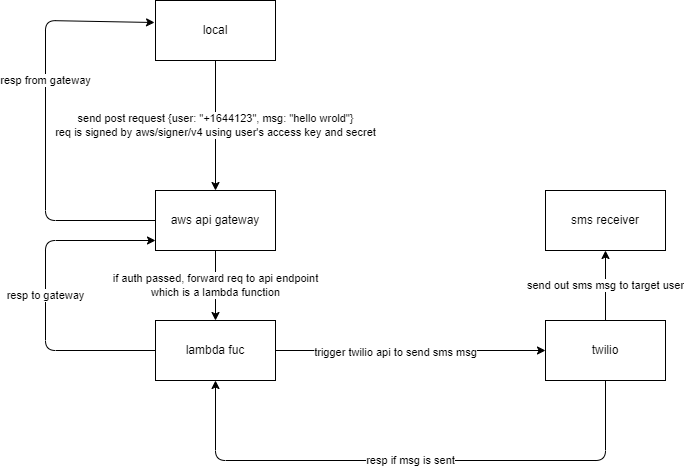

# Integrate twilio in aws lambda function <Badge text="AWS" type="warning" />

## architecture


## steps to implement

### lambda function setup
1. setup lambda function to send request to twilio api
```go

package main

import (
	"context"
	"encoding/json"
	"fmt"
	"os"

	"github.com/aws/aws-lambda-go/lambda"
	"github.com/twilio/twilio-go"
	twilioApi "github.com/twilio/twilio-go/rest/api/v2010"
)

type Payload struct {
	To  string `json:"to"`
	Msg string `json:"msg"`
}

func HandleRequest(ctx context.Context, event *Payload) (*string, error) {
	fmt.Println(event)
	if event == nil {
		return nil, fmt.Errorf("received nil event")
	}
	SendSMS(*event)
	message := fmt.Sprintf("send message %s to %s!", event.Msg, event.To)
	return &message, nil
}

func main() {
	lambda.Start(HandleRequest)
}

func SendSMS(payload Payload) (resp []byte, err error) {
	from := os.Getenv("from")
	username := os.Getenv("username")
	password := os.Getenv("password")
	// from := os.Getenv("TWILIO_TO_PHONE_NUMBER")

	client := twilio.NewRestClientWithParams(twilio.ClientParams{
		Username: username,
		Password: password,
	})

	params := &twilioApi.CreateMessageParams{}
	params.SetTo(payload.To)
	params.SetFrom(from)
	params.SetBody(payload.Msg)

	t, err := client.Api.CreateMessage(params)
	if err != nil {
		return
	}
	resp, err = json.Marshal(*t)
	return
}
```
p.s. remember to add environmental variable in lambda configuration tab.

2. build your main.go into a zip file, then upload to lambda function
```makefile
.PHONY: build
build:
	GOARCH=amd64 GOOS=linux go build -o bootstrap main.go;\
	zip bootstrap.zip bootstrap
```
p.s. the output executable file name has to be bootstrap. remember to upload it to lambda console under code tab and change the handler name to main in Runtime settings.

### api gateway setup
1. build api
create api -> REST API -> enter api name -> create

2. associate that lambda function as a endpoint
create resource -> enter resource name: sms -> create resource

now you should have a /sms resource under root path. then you can

create method -> lambda function -> select request method (POST) -> select the lambda function you just created -> create method

now you should have a POST method under /sms resource

3. add auth for the api-gateway
This can be done several ways. I tried the following two approaches: attach policy to user group or attach policy to api-gateways

#### 3.1 attach policy to user group
3.1.1 create a group which has access policy to the api gateway:
create group -> enter group name -> seach AmazonAPIGatewayInvokeFullAccess policy -> create iser group

in case AmazonAPIGatewayInvokeFullAccess policy changed, the actual policy is like this:
```json
{
    "Version": "2012-10-17",
    "Statement": [
        {
            "Effect": "Allow",
            "Action": [
                "execute-api:Invoke",
                "execute-api:ManageConnections"
            ],
            "Resource": "arn:aws:execute-api:*:*:*"
        }
    ]
}
```

##### 3.1.2 add user to that group
IAM console->create new user -> enter user name -> add user to group -> select the group you just created -> create user

3.1.3 create access keys for user and copy that key in your host machines' .aws/config file, like this:
```bash
[profile user1]
region = us-west-1
service = execute-api
aws_access_key_id = xxxxxxx
aws_secret_access_key = xxxxxxxx

[profile user2]
region = us-west-1
service = execute-api
aws_access_key_id = xxxxx
aws_secret_access_key = xxxxx
```

#### 3.2 attach policy to api gateway
this approach can be used to implement further detailed control the access to each endpoint of that gateway.

3.1.2 create a user in IAM and copy its ARN.
3.1.3 attach policy:
API gateway console -> Resource policy -> add policy
then paste the following policy:
```json
{
  "Version": "2012-10-17",
  "Statement": [
    {
      "Effect": "Allow",
      "Principal": {
        "AWS": [
          "arn:aws:iam::xxx:user/di2",
          "arn:aws:iam::xxx:user/di",
          "arn:aws:iam::xxx:root"
        ]
      },
      "Action": "execute-api:Invoke",
      "Resource": "arn:aws:execute-api:us-west-1:xxx:xxx/beta/POST/lambdav2"
    }
  ]
}
```
which is modified based on AWS account allow list template.

Remember to deploy api again to take that policy into effect.

### call api gateway from local go code
after api deployed, you can see a invoke url displayed in stage details panel. We need to call the url attached to the endpoint which bind with lambda function to invoke the lambda function. And in order to auth, we need to sign the request using aws-sdk-go-v2/aws/signer/v4.


```go
package main

import (
	"bytes"
	"context"
	"crypto/sha256"
	"fmt"
	"log"
	"net/http"
	"time"

	v4 "github.com/aws/aws-sdk-go-v2/aws/signer/v4"
	"github.com/aws/aws-sdk-go-v2/config"
)

func main() {

	/*
	  load shared credentials files from ~/.aws/config,
	  sample config file:
	  [profile admin]
	  region = us-west-1
	  service = execute-api
	  aws_access_key_id = xxxxxx
	  aws_secret_access_key = xxxxxxxxxx

	  visit https://docs.aws.amazon.com/sdkref/latest/guide/file-format.html for more details
	*/
	ctx := context.Background()
	cfg, err := config.LoadDefaultConfig(ctx, config.WithSharedConfigProfile("di2"))
	if err != nil {
		log.Fatalf("unable to load SDK config, %v", err)
	}

	// check if credential is valid
	credentials, err := cfg.Credentials.Retrieve(ctx)
	if err != nil {
		log.Fatalf("Credentials.Retrieve err, %v", err)
	}

	apiUrl := "your-invoke-url"
	// apiUrl := "https://<endpoint-url>"
	// Request body
	// jsonStr := []byte(`{"To":"<target-phone-number>","Msg":"hello world"}`)
	jsonStr := []byte(`{"To":"+1xxxxx","Msg":"asdfasd"}`)

	req, err := http.NewRequest("POST", apiUrl, bytes.NewBuffer(jsonStr))
	if err != nil {
		log.Fatalf("http.NewRequest err, %v", err)
	}

	reqBodyHashBytes := sha256.Sum256(jsonStr)
	reqBodyHashHex := fmt.Sprintf("%x", reqBodyHashBytes)

	signer := v4.NewSigner()
	if err = signer.SignHTTP(ctx, credentials, req, reqBodyHashHex, "execute-api", cfg.Region, time.Now()); err != nil {
		fmt.Printf("Error signing request.\n")
		return
	}
	client := &http.Client{}
	resp, err := client.Do(req)
	if err != nil {
		fmt.Println("Error reading response body:", err)
		return
	}
	defer resp.Body.Close()

	fmt.Println("response Status:", resp.Status)
	// Print the response body
	buf := new(bytes.Buffer)
	buf.ReadFrom(resp.Body)
	fmt.Println("response Body:", buf.String())
}
```