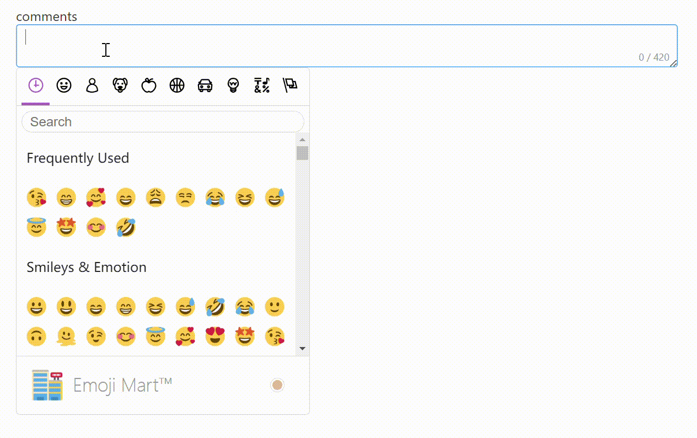

# Integrate emoji-mart-vue-fast in elementPlus `<el-input>` <Badge text="emoji-mart-vue-fast" type="warning" />

### purpose
Integrate emoji-mart-vue-fast with `<el-input>` component so that user can insert emoji at input field.


```vue
<!--
* @fileName comments.vue
* @author Di Sheng
* @date 2023/07/26 08:48:32
* @description display article comments
!-->
<template>
  <div>comments</div>
  <el-input
    ref="inputRef"
    v-model="input"
    maxlength="420"
    show-word-limit
    type="textarea"
    style="max-width:800px"
  />
  <Picker
    :set="`twitter`"
    :data="emojiIndex"
    @select="addEmoji"
  />

</template>

<script>
import { defineComponent, toRefs, reactive } from 'vue'
import { Picker, EmojiIndex } from 'emoji-mart-vue-fast/src'
import data from 'emoji-mart-vue-fast/data/all.json'
import 'emoji-mart-vue-fast/css/emoji-mart.css'
import _ from 'lodash'
export default defineComponent({
  name: 'Comments',
  components: {
    Picker,
  },
  setup(props, ctx) {
    const state = reactive({
      inputRef: null,
      input: '',
    })

		// replace str from index poStart to poEnd with sub// if poStart == poEnd, then it's an insert function
		const insertAt = (str, sub, poStart, poEnd) => `${str.slice(0, poStart)}${sub}${str.slice(poEnd)}`

    const emojiIndex = new EmojiIndex(data)
    const addEmoji = (emoji) => {
      const e = state.inputRef.ref
      state.input = insertAt(state.input, emoji.native, e.selectionStart, e.selectionEnd)
      e.focus()
      const pos = e.selectionStart + emoji.native.length
      setTimeout(() => { e.setSelectionRange(pos, pos) }, 0) //alternatively, you can use nextTick()
      console.log('---addEmoji--', emoji.native)
    }
    return {
      addEmoji,
      emojiIndex,

      ...toRefs(state)
    }
  }
})
</script>
```

> state.inputRef.ref.focus()
const pos = e.selectionStart + emoji.native.length
setTimeout(() => { e.setSelectionRange(pos, pos) }, 0) //alternatively, you can use nextTick()

the reason for using setTimeout to change cursor position is that dom is not updated immediately after focus(), so we need to put mover setSelectionRange() to the event loop so it get executed 'nextish' after focus on input action took place.

