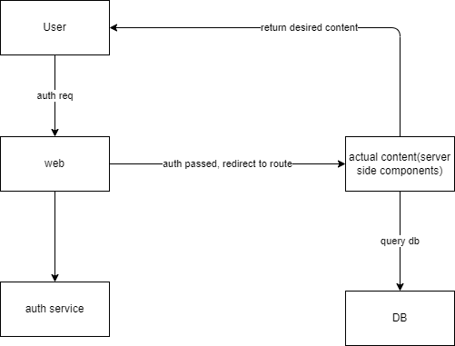

# Brief talk about React server side component<Badge text="React" type="warning" />

Is it a good idea to use server side component in React? My first impression is like: why do we need such thing? Am I back to 10 years ago where we write embedded html templates like .erb in rails? So I spent some time digging how it works to figure out if it's a good idea to use it in the future.

## Concept
Core concept about react server side component is that it can generate 'virtual node' in server side and pass it back to render at browser. It's more SEO friendly and improved UX since user won't need to download all the bundler js files.

## Constrains
However, the biggest limitation about this approach is that: everything has to be done at first request (when first req was sent to your server to request frontend resources).

Based on this limitation, first thing in my mind is: how to auth? Yea it's true that server side component can direct run sql to fetch data from backend db, but how you make sure current use has enough privilege to do that operation? So auth is a must have step right before any resource are fetched from Server side component. Initially I thought this might violate the biggest constrain: everything must be done at first request because: YOU HAVE TO MAKE A AUTH CALL.

### Workaround
Then I thought deeper, how can auth done? answer is JWT or session. If user has logged in that web before, we can use JWT or session for auth at the first request, then we can use server side component's power to finish the job. However, what if user is first time login the web?

The workaround answer is: **REDIRECT**

That's quite often we see after success auth, we are redirect several times before finally landed into the page we want to. When redirect happens, route changed and so new request for certain page were sent to the server, and that request can be seen as 'first request' so server side component can be used in such scenario.

As long as all server side component page has its specific router defined(so no dynamic values are passed to server side component), ideally we only need an auth service backend api and let server side component take care of the rest.

## Conclusion
Currently the limitation of server side component is still huge. You can only use it when your url changed. Which means it's not suitable to use in modal, pop ups, paged table, infinite loading etc. Which means you still need backend api endpoint to backup those functions. So why brother to use server side component at the first place? I guess the only possible scenario I would use it is the landing page. Now react 19 is almost out, let's wait and see.