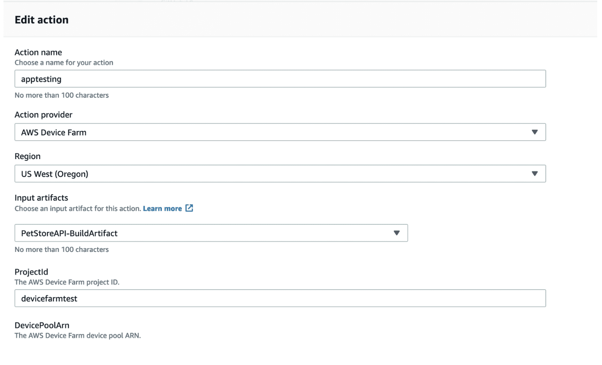

# AWS Testing with CodePipeline<Badge text="Testing" type="warning" />

## CodePipeline
powerful automation framework for the CD process.

### Device Farm
a service that enables to test mobile OS apps on real devices (not emulators or simulators), allow video, screenshots, logs and performance data viewing.
## Regression testing
Regression testing accounts for almost 1/2 of software maintenance costs and up to 80% of the testing budget

### Device Farm
a service that enables to test mobile OS apps on real devices (not emulators or simulators), allow video, screenshots, logs and performance data viewing.

The pipeline should be configured as following:

## Performance testing
Performance testing determines how your system performs in terms of responsiveness and stability under a specific workload
### Load testing
- determines performance of a system under load
- simulates multiple users concurrently accessing the system with test scripts
- Measures an application's quality of service.
##### BlazeMeter
extends Apache JMeter by providing some additional capabilities such as automatic scaling and professional reporting
### Stress testing
- Understands limits of the system
- Discovers at what point the software fails
- help determine how long it takes to recover from failure
### Soak testing
- runs normal workloads but for extended periods of time
- checks for potential issues such as memory leaks
- helps determine how long an unexpected load can be maintained
### Spike testing
- increases workloads quickly and repeatedly
- Helps determine if dramatic increase or decreases in load affect performance
### Breakpoint testing
- Measures the maximum capacity the system can run and still meet its service-level agreements
- Helps determine what metrics should be used to determine a scale-out event
### Configuration testing
- tests the effects of configuration changes
- helps determine optimal combinations of hardware and software
### Isolation testing
- Repeats a test that resulted in a system problem to determine fault
- Helps isolate and confirm the fault domain
### User acceptance testing(UAT)
- where actual users test the software to ensure it can handle the required tasks.
- A/B testing: Alpha testing is done in the dev env, while beta testing is done as a field test on client side
- Black-box testing: check input and output without knowledge of the system internals
### Metrics to be collected
- Average response time
- Peak response time
- Error rates
- Concurrent users
- RPS (request per second)
- throughput