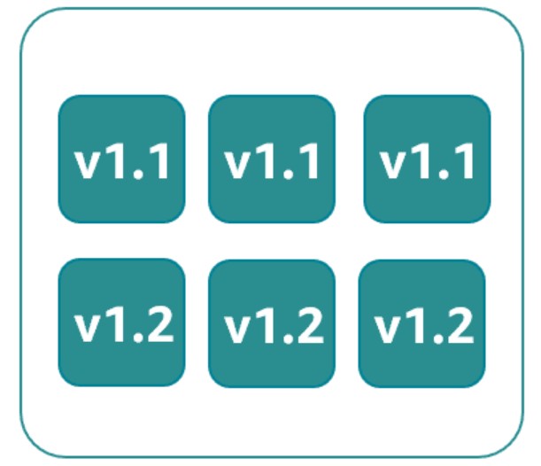
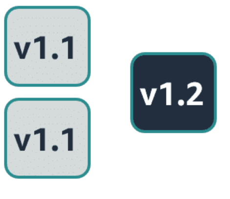

# AWS CodeDeploy <Badge text="CodeDeploy" type="warning" />
## Rolling deployment
Your production fleet will run both the new and existing software versions during the deployment process.
#### Pros
- zero downtime (If the upgrade failed)
- lower overall risk of bringing down entire production env
- minimize deployment costs
#### Cons
- complexity increased since you need to handle two versions operating at once in the same env.
- Rolling back to previous version is hard, either redeploy old version or fix bugs manually
- take longer to deploy all hosts in large env


## Blue/Green deployment
an entirely new environment containing the updated application is created, and traffic is shifted over to the new environment


## Health Checks
determine if a deployment was successful or the app is working as intended.
### Liveness checks
- TCP port checks
- HTTP 200 response checks
- basic infra inspection, such as network reachability
### Local health checks
- Disk IO
- proxy checks
- monitoring daemons checks
### Dependency health checks
- update mechanism might be broken on a server so server can out of sync with its peers.
- peer communication inability.
- Deadlocks, memory leaks or state corruption bugs
### Anomaly detection
- clock skew: peer clock un-sync
- peer running outdated code

## Deployment Configurations
#### CodeDeploy Predefined Deployment Configurations
##### Amazon EC2 and on premises
- CodeDeployDefault.AllAtOnce: Attempts to deploy an application revision to as many instances as
possible at once
- CodeDeployDefault.HalfAtATime: Deploys to up to half of the instances at a time (with fractions rounded
down)
- CodeDeployDefault.OneAtATime: Deploys the application revision to only one instance at a time
Amazon ECS
- CodeDeployDefault.ECSLinear10PercentEvery1Minutes: Shifts 10 percent of traffic every minute until all traffic is shifted
- CodeDeployDefault.ECSLinear10PercentEvery3Minutes: Shifts 10 percent of traffic every 3 minutes until all traffic is shifted
- CodeDeployDefault.ECSCanary10Percent5Minutes: Shifts 10 percent of traffic in the first increment, and the remaining 90
percent is deployed 5 minutes later
- CodeDeployDefault.ECSCanary10Percent15Minutes: Shifts 10 percent of traffic in the first increment, and the remaining 90
percent is deployed 15 minutes later
- CodeDeployDefault.ECSAllAtOnce: Shifts all traffic to the updated Amazon ECS container at once
Lambda
- CodeDeployDefault.LambdaLinear10PercentEvery1Minute: Shifts 10 percent of traffic every minute until all traffic is shifted
- CodeDeployDefault.LambdaLinear10PercentEvery2Minutes: Shifts 10 percent of traffic every 2 minutes until all traffic is shifted
- CodeDeployDefault.LambdaLinear10PercentEvery3Minutes: Shifts 10 percent of traffic every 3 minutes until all traffic is shifted
- CodeDeployDefault.LambdaLinear10PercentEvery10Minutes: Shifts 10 percent of traffic every 10 minutes until all traffic is shifted
- CodeDeployDefault.LambdaCanary10Percent5Minutes: Shifts 10 percent of traffic in the first increment, and the remaining 90
percent is deployed 5 minutes later
- CodeDeployDefault.LambdaCanary10Percent10Minutes: Shifts 10 percent of traffic in the first increment, and the remaining 90
percent is deployed 10 minutes later
- CodeDeployDefault.LambdaCanary10Percent15Minutes: Shifts 10 percent of traffic in the first increment, and the remaining 90
percent is deployed 15 minutes later
- CodeDeployDefault.LambdaCanary10Percent30Minutes: Shifts 10 percent of traffic in the first increment, and the remaining 90
percent is deployed 30 minutes later
- CodeDeployDefault.LambdaAllAtOnce: Shifts all traffic to the updated Lambda functions at once

## Deployment Types
### Blue/Green deployment
- testing on green env without disrupting the blue env
- switching to green env with no downtime. It only requires the redirecting of user traffic
- rollback from green to blue is easy
#### Steps for blue/green deployment in EC2
1. create green env
2. deploy new version of app in green env
3. redirect traffic to green env
4. deregister blue env or keep it for other uses

#### Steps for blue/green deployment on Lambda
- no need for extra config, all lambda are deployed in blue/green manner
- you can specify a lambda function that perform validation tests and choose the way traffic shifting occurs

#### Steps for blue/green deployment on ECS
- traffic is shifted from the task set with original version of APP in ECS service to replacement task set in the same service
- traffic shifting can be linear or canary through deployment config
- load balancer are used to reroute traffic
- can run validation tests with a test listener that used to serve traffic to the replacement task set

## AppSpec
The AppSpec file is used to manage each deployment as a series of lifecycle event hooks

#### sample files
- Amazon ECS
```yaml
version: 0.0
resources:
# Specifies info about the ECS APP to deploy
  ecs-service-specifications
hooks:
  deployment-lifecycle-event-mappings
```

- Lambda
```yaml
version: 0.0
resources:
# Specifies info about the lambda function to deploy
  lambda-function-specifications
hooks:
  deployment-lifecycle-event-mappings
```

- EC2 or on-premises
```yaml
version: 0.0
os: operating-system-name # linux or windows
files:
  source-destination-files-mappings #files that should be copied to the instance during the deployment's install event
permissions:
  # which special permissions should be apply to the files that copied to the instance
  permissions-specifications
hooks:
  deployment-lifecycle-event-mappings
```

### LifeCycle hooks
```yaml
version: 0.0
Resources:
  - TargetService:
      Type: AWS::ECS::Service
      Properties:
        TaskDefinition: "arn:aws:ecs:us-east-1:111222333444:task-definition/my-task-definition-family-name:1"
        LoadBalancerInfo:
          ContainerName: "SampleApplicationName"
          ContainerPort: 80
# Optional properties
        PlatformVersion: "LATEST"
        NetworkConfiguration:
          AwsvpcConfiguration:
            Subnets: ["subnet-1234abcd","subnet-5678abcd"]
            SecurityGroups: ["sg-12345678"]
            AssignPublicIp: "ENABLED"
Hooks:
  - BeforeInstall: "LambdaFunctionToValidateBeforeInstall"
  - AfterInstall: "LambdaFunctionToValidateAfterTraffic"
  - AfterAllowTestTraffic: "LambdaFunctionToValidateAfterTestTrafficStarts"
  - BeforeAllowTraffic: "LambdaFunctionToValidateBeforeAllowingProductionTraffic"
  - AfterAllowTraffic: "LambdaFunctionToValidateAfterAllowingProductionTraffic"
```

- BeforeInstall: before ECS app is installed on the replacement task set
- AfterInstall: after install but before it receives any traffic
- AfterAllowTestTraffic: after app starts receiving traffic from the test listener, which runs validation tests to determine if the deployment continues.
- BeforeAllowTraffic: after tests completed, but before production traffic is served
- AfterAllowTraffic: after production traffic is served

[AppSpec_Hooks_by_Deployment](../../../public/pdf/2024/05/07/AppSpec_Hooks_by_Deployment.pdf)