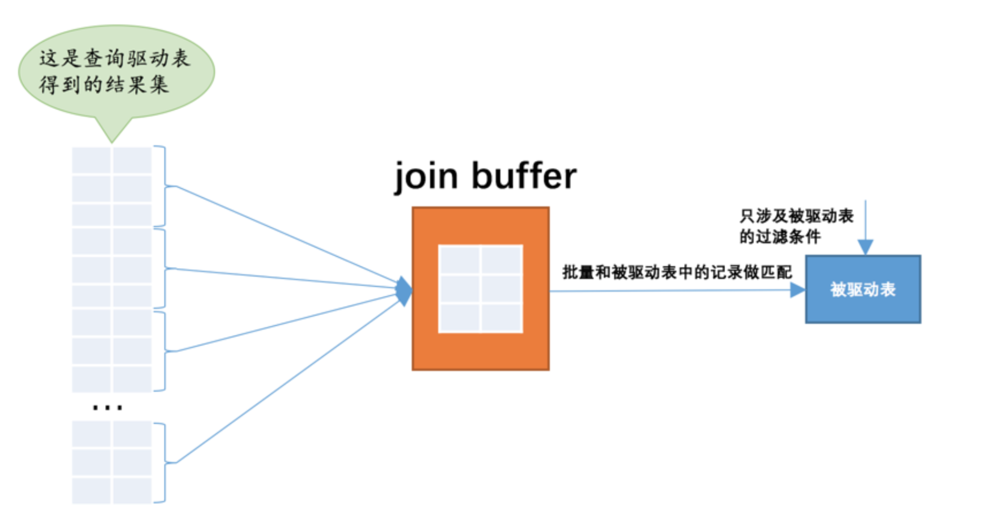

# How join works <Badge text="MySQL" type="warning" />

example tables:
```sql
CREATE TABLE t1 (
	m1 INT,
n1 CHAR ( 1 ));
CREATE TABLE t2 (
	m2 INT,
n2 CHAR ( 1 ));
INSERT INTO t1
VALUES
	( 1, 'a' ),
	( 2, 'b' ),
	( 3, 'c' );
INSERT INTO t2
VALUES
	( 2, 'b' ),
	( 3, 'c' ),
	( 4, 'd' );
```

if we execute
```sql
select * from t1, t2
```
the result is Cartesian product of t1 X t2

| m1 | n1 | m2 | n2 |
|  :----  | :----  |  :----  | :----  |
| 3 |	c |	2	| b |
|2	| b	| 2 | b |
|1	| a	| 2 |	b |
|3	| c	| 3 |	c |
|2	| b	| 3 |	c |
|1	| a	| 3 |	c |
|3	| c	| 4 |	d |
|2	| b	| 4 |	d |
|1	| a	| 4 |	d |

example 2:
```sql
select * from t1, t2
where t1.m1 > 1 and t1.m1 = t2.m2 and t2.n2 < 'd'
```
execute process:
1. using all operation to select t1.m1 > 1 rows from t1. in this case, which are m1 = 2 and m1 = 3 two rows
2. use the result from step 1, convert  t1.m1 = t2.m2 to t2.m2 = 2 and t1.m1 = t2.m2 to t2.m2 = 3 two searches. combine with  t2.n2 < 'd', we can lookup result using single table t2.
So we totally visit t1 once and t2 twice.

However, if matched result from step 1 is n, we might need to visit t2 n times.

### Type of join
- inner join : where and on have same effect
equivalent expression of inner join:
```sql
SELECT * FROM t1 JOIN t2;
SELECT * FROM t1 INNER JOIN t2;
SELECT * FROM t1 CROSS JOIN t2;
SELECT * FROM t1, t2;
```

- outer join
  - left join: left table is the driver table
  - right join: right table is the driver table

where will effect on both tables.
on: for outer join, if the Driven table cannot find records matching on condition, then its column will be filled with null.

### Not using select *
because some columns is not indexed, so when searching the driven table, we can only do whole table scan.

### Block Nested-Loop Join
Since the driven talbe may be visited n times, each time sql have to load data from disk into memory and then do the scan and compare in memory. Once n become large, I/O cost would be huge, so we use Block Nested-Loop Join to reduce the visit time of driven table.

The approach is like the following:
After get a result set from driver table, we load them into a join buffer. Then we load one row from driven table, compare to each of data stored in join buffer. If join buffer is big enough to hold all the result set from driver table, we only need to scan driven table once.


The default size of join buffer is 256kb and minimum you can set is 128bytes.

***P.S.*** since the columns that put into join buffer is the ones from select, so better avoid using * to save space.
