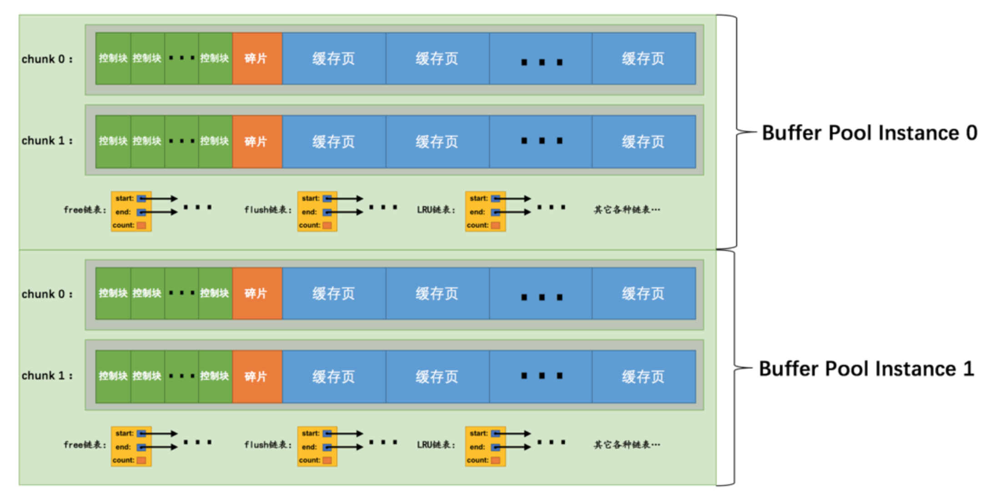

# InnoDB Buffer Pool <Badge text="MySQL" type="warning" />

Recall the memory that when mysql handle a query toward a page, it first load the page into memory, but when query is done, that page is not removed from memory immediately, it's cached to be used later. Buffer pool is a continuous memory allocate for buffering pages.

> [server]
innodb_buffer_pool_size = 268435456

- default buffer pool size is 128MB and minimum accept value is 5MB.
- default buffer page size is 16KB, same as page size.
- each buffered page has a control block(~5% of 16kb which is around 808B) which contains the info of that page.

#### free linked-list
During initialization of buffer pool, a continuous allocate of memory was divided into control blocks and buffered pages. Mysql generated a linked-list to store the control block for those freed buffered pages.

#### Dirty Page
If we modify the buffered page, so it's not identical to the page in disk, it's called dirty page. Once there's a dirty page, we create a linked-list to store those dirty pages and sync the data to disk in the future. This linked-list of dirty pages is called flush linked-list.

#### LRU
Sometimes pool size is limited, mysql implement LRU to clean up those not frequently used buffered pages.

#### Read ahead
- linear read ahead:
a global system variable called **innoodb_read_ahead_threshold** (default value is 56) are used to set the condition to trigger read ahead trigger. Once an extent's pages are visited in order and more times than this variable, all extent pages will be load to the pool.

- random read ahead:
***innodb_random_read_ahead*** control whether to read ahead randomly. It means if more than 13 continuous pages from same extent are visited, even not visited in order, the remaining pages from that extend will be loaded to the memory.

Two worst cases might happen are:
1. page from buffer pool may not be sed
2. when whole table scan happened, those frequently used cached pages will be removed from linked-list by LRU

Solutions:
divided linked-list into young(hot) and old(cold) section, the percentage of each section is controlled by ***innodb_old_blocks_pct***
> mysql> SHOW VARIABLES LIKE 'innodb_old_blocks_pct';

---
| Variable_name         | Value |
|---|---|
| innodb_old_blocks_pct | 37    |

so old blocks is 37% of whole linked-list. This value can be changed by config, but it's a global variable that applies to all clients.
>[server]
innodb_old_blocks_pct = 40

##### How it solve the above two problems?
1. once a page first time loaded to the buff, it will be placed at the head of old section.
2. Regarding to whole table scan, introduce a variable called **innodb_old_blocks_time**
> mysql> SHOW VARIABLES LIKE 'innodb_old_blocks_time';

| Variable_name          | Value |
|---|---|
| innodb_old_blocks_time | 1000  |
unit is ms.
We know that every time reading a record from a page count as a visit to that page. Usually a page contains many records, which means reading those records counts as many times of visit to that page.
Also we know that whole table scan not happen too often, so for a page from old section are visited at first time, we store a timestamp of that visit. Then if it's visited later, we compare the time difference, if less than innodb_old_blocks_time, we don't move it to the head of young section.

##### other optimization of LRU linked-list
- only move the page to the head of young section if that page is located in the last 3/4 part of young section. So if that page is located on first 1/4 part of young section, it's not gonna be moved.

- other type of linked-list:
e.g.
unzip LRU linked-list to manage unzip pages
zip clean linked-list tp manage compressed pages
zip free array etc..

#### Load Dirty Pages into disk
- BUF_FLUSH_LRU:
corn job that running frequently to scan pages from the tail of LRU (which is the old section) and flush the dirty pages into disk.

#### multiple buffer pool instance
when dealing with multi-thread and high co-current situation, each linked list in buffer pool need to lock and unlock. We can create multiple buffer pool instance, and each instance is independent, by doing this setting:
>[server]
innodb_buffer_pool_instances = 2

each buffer pool's size = innodb_buffer_pool_size/innodb_buffer_pool_instances

When innodb_buffer_pool_size < 1G, then multiple buffer pool setting is invalid and InnoDB will set buffer pool size to 1. However, when > 1G, it's encouraged to set buffer pool size > 1

#### Buffer pool chunk size
for MySQL 8+, we can adjust buffer pool size on the runtime. Because buffer pool is now composite into several chunks.

chunk is smaller unit, which contains several cached pages and control blocks. Default chunk size is 128MB,
and it can only be set at mysql init process, by innodb_buffer_pool_chunk_size, unit is bytes (B).

P.S this chunk size is not including the 5% size of control blocks. so actual chunk size is 1.05 times bigger than the setting number

#### Things to keep eye on when setting buffer pool
- innodb_buffer_pool_size = n * innodb_buffer_pool_chunk_size * innodb_buffer_pool_instance

Service init process will auto set innodb_buffer_pool_size based on the above rule, os
1. if innodb_buffer_pool_size > innodb_buffer_pool_chunk_size * innodb_buffer_pool_instance but not a n times multiplier, service will round up innodb_buffer_pool_size
2. if innodb_buffer_pool_size less than, then  innodb_buffer_pool_size / innodb_buffer_pool_instance as the innodb_buffer_pool_chunk_size value.