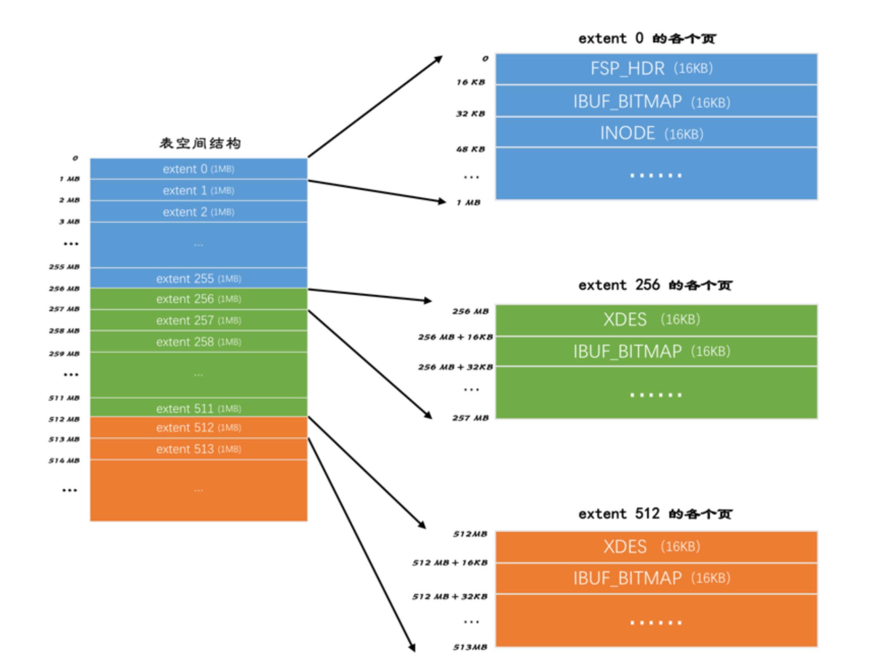
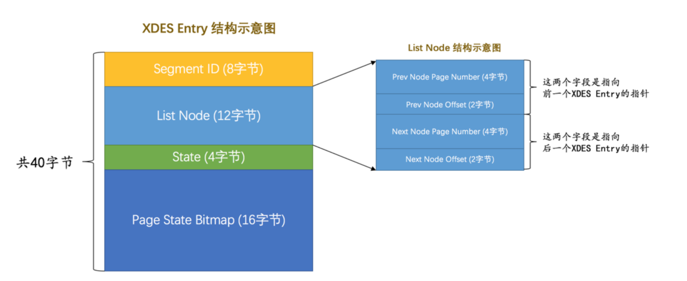
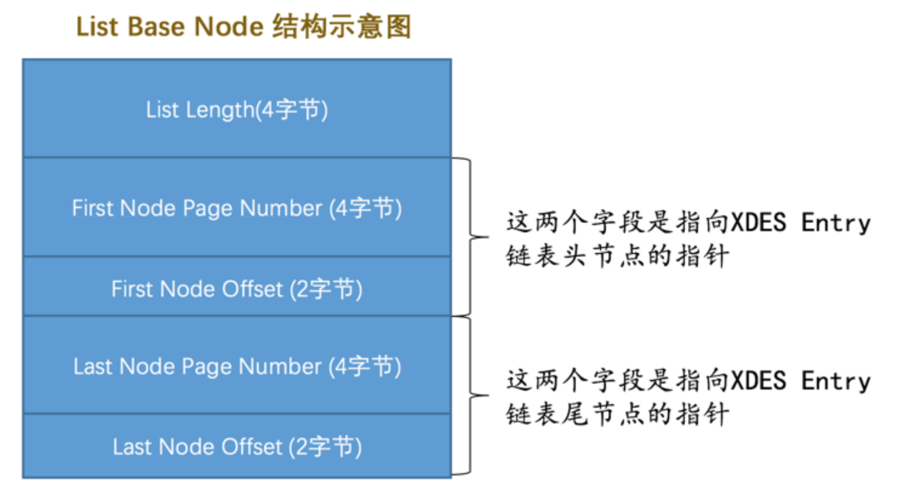

# Datadir <Badge text="MySQL" type="warning" />

##### check where datadir is
```sql
show variables like 'datadir'
```

Once a new database is created, a folder named by that database is created under datadir. And in that new created folder, a dp.opt file is created to store the info of that db.


### table space
Then inside each db folder, each table have a table_name.ibd file, which stored maximum 2^32 pages. Since each page is 16kb, so a table space can hold maximum 64TB size of data

### extent
Since a table space can hold too many pages, mysql introduced a concept called extent, which is 64 consecutive pages. with each page takes 16kb, an extent occupied 1MB space. Every 256 extent can be grouped together



The reason for using extent is to eliminate random I/O in range search. If pages that stored the min and max value are physically far away rom each other, loading the in-between pages may require random I/O scan over disk space. So we introduce the concept of extent, which can store up to 64 consecutive pages to eliminate random I/O.

### Segment and Fragment
Each index will create two segment, one to store the leaf nodes(those with actual data) and one to store other nodes.

However, when a table with only a few records, each of its indexes will create minimum 2 segment, which takes 2MB space. It's a waste of space so mysql introduce the concept of fragment.

Fragment is a special extent that can contain pages from different segment. Fragment is directly belongs to table space, when data initially come into the table, mysql assign storage space page by page from fragment. Once a segment contains 32 fragment pages was, mysql start assign storage space extent by extent.

##### Type of extent
|  State   | Meaning  |
|  :----  | :----  |
|  FREE  | Free extent |
|  FREE_FRAG  | Fragment with free space |
|  FULL_FRAG  | full Fragment|
|  FSEG  | extent belongs to certain segment|

***p.s.*** Extent has status of FREE, FREE_FRAG and FULL_FRAG belongs to the table space directly, and FSEG belongs to certain segment


##### XDES
Extent Descriptor Entry: store info of extent for better management.


We can form three linked lists using info provided from XDES.
- extents with status FREE
- extents with status FREE_FRAG
- extents with status FULL_FRAG

Example:
for the following table
```sql
create table t (
  c1 int not null auto_increment,
  c2 varchar(100),
  c3 varchar(100),
  primary key (c1),
  key idx_c2(c2)
) engine=InnoDB;
```
table t has two index, which turns to 4 segments. Each segment will create three linked lists: FREE, FREE_FRAG and FULL_FRAG.

In order to better describe these linked list, mysql introduced a structure called List Base Node

