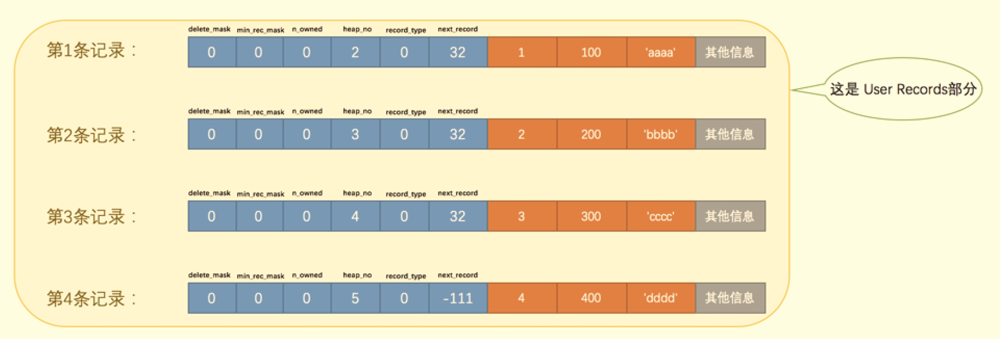
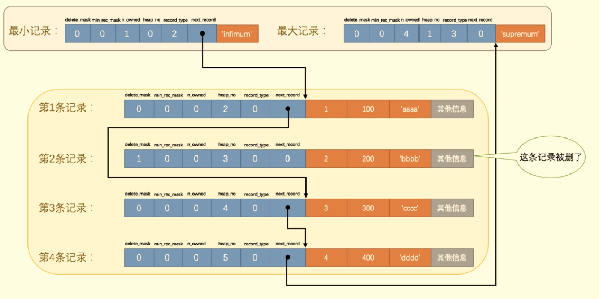
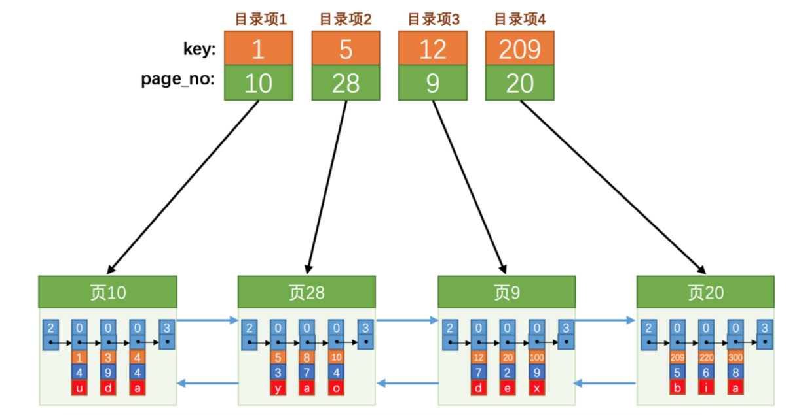
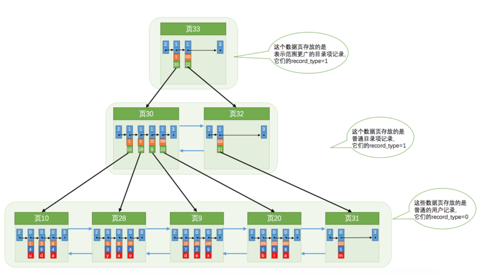
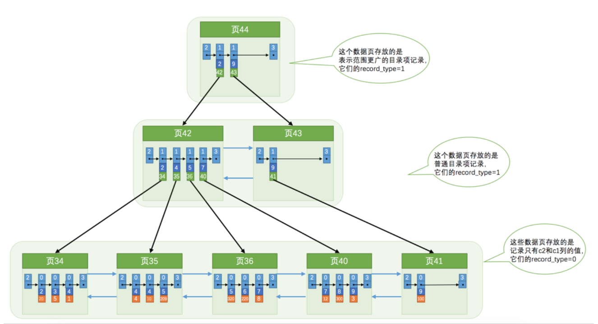
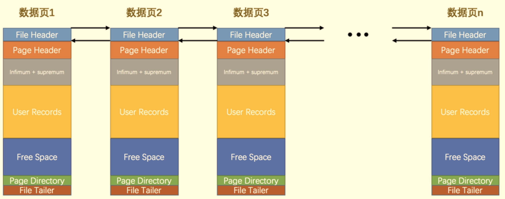

# File And Page <Badge text="MySQL" type="warning" />
### page


User records is where innodb used to store data


- delete_mask
when data get delete in page, it obtained a delete_mask and its address and space is record in a garbage linked list where their space are declared reusable.

- infimum & supremum
the record next to infimum record is the min record stored in page and the max record's next is supremum


##### page directory
like a book directory. In order to improve the search efficiency, a page will divided records into several slots based on the following rules. so each time when look up a record, we can use binary search instead.

Constrains:
1. infimum has its own slot
2. the slot contains supremum should have 1~8 records
3. other slot contains records count from 4~8

Rules:
1. initially create two slot, which contains infimum and supremum separately
2. when insert new record nr, find the slot which has a primary key value that bigger than nr's primary key and diff of those two key are minimum, until the member of this slot reached 8
3. when a slot already has 8 members and a new record is come into that slot, we divided this slot into 2 slots, one has 4 records and other has 5.

##### page splitting
when a page is full and a new record is coming, a new page is created and formed a two-way linked list with prev page. Since one constrain of page is that new page's primary key should be bigger than old page's. so the new record may need to be swapped with record from old page.
***p.s.*** page number may not be consecutive. e.g. page 3 may linked to page 28.

##### page directory entry
a page that isolated from other pages, with record_type = 1, used to store info of all other pages. It only contains two columns: page_no and min_primary_key in that page.
So when searching, we can use the info in this page directory to apply dichotomy search.



##### page directory tree(B+ tree)
when more page directory is required when pages increased, we can use B+ tree to store the relation between each page directories.

As shown in the graph, actual records are stored at leaf nodes of the tree, which is referred as layer 0. So this graph's tree has two layers.

***Constrains:***
- if tree only has 1 layer, it can only has 1 leaf node which contain 100 data records.
- each additional layer add 1000 times more leaf nodes, each contain 100 data records.

so a 4 layer tree can contain 1000×1000×1000×100=100000000000 (10^11) rows of user data records, which is more than enough to use.

##### Secondary index (another B+ tree)
Default index is created by primary key. When the column is not indexed, we can create a secondary index to help us search faster. 

As noticed in the graph, the leaf nodes is no more storing user data. Instead, it stored the relation between primary key and the secondary indexed column.

So when we look up a user record using secondary index, we first find its primary key using that new B+tree, then we use the primary key to look up for the actual user data in the default B+ tree.

#### Union index (special secondary index)
we can use two column together as a union index, e.g. c2 and c3. The rule is that we first compare each record using c2, if equal, then compare using c3. The other difference is that the leaf nodes now will store the primary key, c2 and c3 value.

The mechanism is same for normal single columned secondary index, which first compare the column value then compare the primary key value.


#### B+ tree root node
when a table is created, a B+ tree root node is created at the same time. When inserting new data into table, we first fill up the root node. When it's full, we first copy the root node data into new page and doing page splitting, then upgrade root node to a page directory to store the info of the split pages.

#### Index operations
1. add index
```sql
alter table a add index idx_xxx1_xxx2(xxx1,xxx2)
-- xxx1 and xxx2 are the columns that need to be indexed

-- or, you can add index when create table
CREATE TABLE index_demo (
	c1 INT,
	c2 INT,
	c3 CHAR ( 1 ),
PRIMARY KEY ( c1 ),
INDEX idx_c2_c3 ( c2, c3 ));
```
2. delete index
```sql
alter table a drop index idx_xxx
```

### FILE
##### FIL_PAGE_PREV & FIL_PAGE_NEXT
when a table contains millions of records, InnoDB  will store them in several pages and use  FIL_PAGE_PREV & FIL_PAGE_NEXT to form a two-way linked list between pages.



##### File Trailer
when record is modified in memory, when sync the change to the storage, we first calculate checksum and write it to File Header, then after sync is done, we calculate checksum again and write it to File Trailer. Then we compare these two checksum, if not equal, means something wrong in the process.