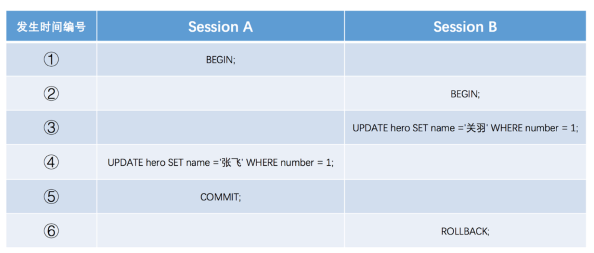
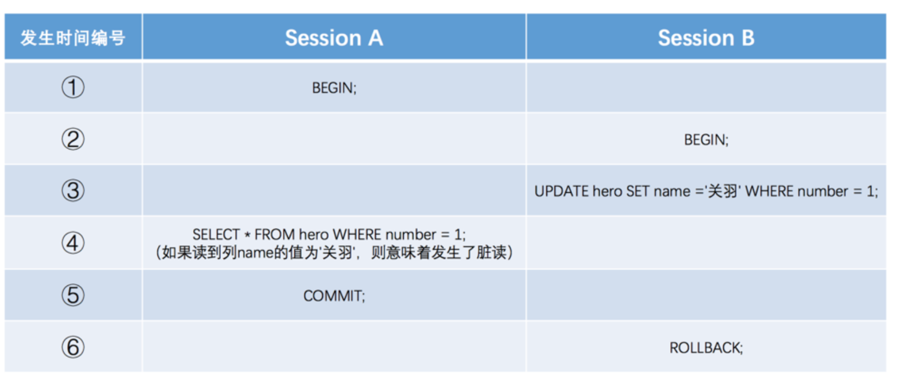
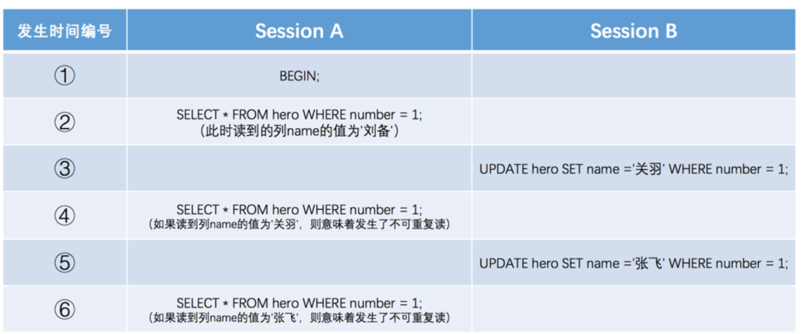
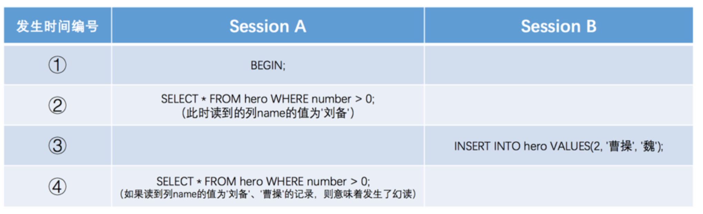

# Isolation Level <Badge text="MySQL" type="warning" />

mysql's arch is client/server. Multiple client sessions may exist on the same time, which means sever will deal with multiple transactions on the same time. By isolation principle of ACID We may need to sacrifice to some lower isolation level to improve performance.

- Dirty write

Session B override Session A operations, rollback session A's commit, caused dirty write

- Dirty read

 A dirty read occurs when a transaction reads data from a row that has been modified by another transaction that ***has not yet been committed***. The problem with dirty reads is that if the other transaction rolls back its changes, the first transaction has read data that technically never existed.

- non-repeatable read
A transaction can read other transaction ***committed*** change before own commit.

- phantom
a transaction can read records that not present in last read.
phantom usually is a range read operation. So after read a range of data, other transaction insert one more data record inside the range, when read again, we can see the result is different.

p.s. for those records missing from last read, it's classified as non-repeatable read.

Obviously, serious level of phenomenal above is:
dirty write > dirty read > non-repeatable read > phantom
So we can set different isolation level to sacrifice some isolation to improve performance.
Standard is:
- READ UNCOMMITTED: allow dirty read, non-repeatable read and phantom
- READ COMMITTED: allow non-repeatable read and phantom
- REPEATABLE READ: only allow phantom (default isolation level)
- SERIALIZABLE: prevent all

##### Manually change isolation level
> SET GLOBAL TRANSACTION ISOLATION LEVEL REPEATABLE READ
> SET SESSION TRANSACTION ISOLATION LEVEL READ COMMITTED
> SET TRANSACTION ISOLATION LEVEL READ UNCOMMITTED
> SET TRANSACTION ISOLATION LEVEL READ SERIALIZABLE

p.s. if no GLOBAL/SESSION keywords present, the setting only affect the next transaction

### MVCC (multi-version concurrency control)
implemented by introduce readview.
Read committed, repeatable read isolation level create readview at different stage.
Read comitted create a readview before each select operation, while repeatable read only create a readview only at the first time select is execute, then re-use the same readview for other select