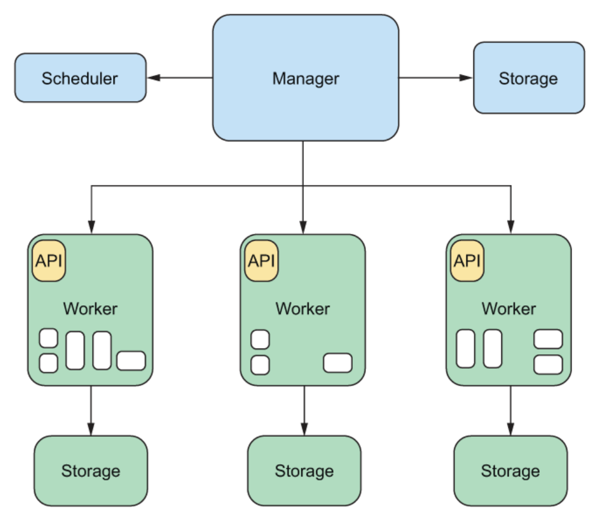
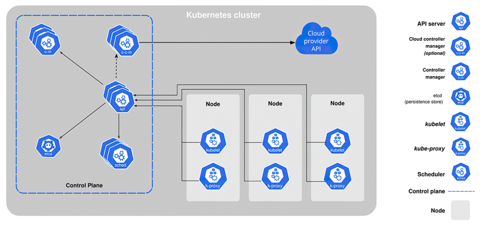

# Basic of Orchestration System <Badge text="Orchestrator" type="warning" />

an orchestrator system automates deploying, scaling, and managing containers.
## Components
- Task
- Job
- scheduler
- manager
- worker
- cluster
- CLI

each orchestrator system should have a scheduler, a manger, and a worker, and they all operate on tasks

#### Tasks (kubernetes objects)
- service that runs in a container, could be nginx, RESTful API server or a script

##### a task should specify:
1. cpu, memory, disk required to run the task
2. restart policy (what should orchestrator do in case of failure)
3. image used for the task

#### Job (kubernetes objects)
- an aggregation of tasks. such as k8s's Deployment, ReplicaSet, StatefulSet, DaemonSet and Job resource types

#### Scheduler
- decides what machine can best host the tasks defined in the job, using algorithms such as round-robin or Enhanced Parallel Virtual Machine(E-PVM)

- The scheduler should perform these functions:
1. Determine a set of candidate machines on which a tasks could run
2. rank them
3. pick the best one

#### Manager (control plane)
- entry point for users. User submit jobs to manager, manager use scheduler find a machine to run job and use assign worker to run the tasks, then collect metrics from each work, so those data can be used in scheduling process

#### Worker (kubelet)
- running manager assigned tasks as docker containers
- providing metrics, health for manager for the purpose of scheduling tasks

