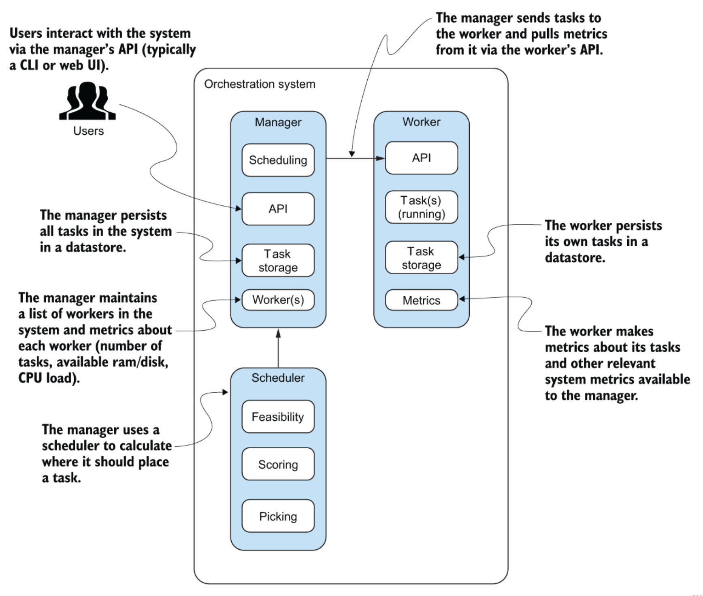
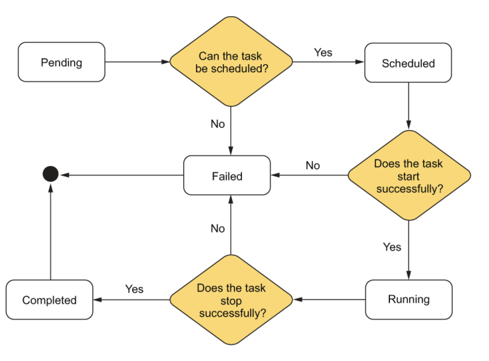

# Cube Project Overview<Badge text="Orchestrator" type="warning" />

### Overall Architecture

### task life-cycle

### Tools and Libs
- Go
- chi
- Docker SDK
- BoltDB
- goprocinfo

#### Docker SDK
We can use docker cli to send command to control docker, or send curl request via UDP or TCP to trigger docker api. Or, we can use high level go docker SDK to communicate with docker. Common APIs are:
- NewClientWithOpts
A helper method that instantiates an instance of the client and returns it to the caller
- ImagePull
Pulls the image down to the local machine where it will be run

- ContainerCreate
Creates a new container with a given configuration

- ContainerStart
Sends a request to Docker Engine to start the newly created container

- ContainerStop
Sends a request to Docker Engine to stop a running container

- ContainerRemove
Removes the container from the host.

- ContainerLogs
ContainerLogs returns the logs generated by a container in an io.ReadCloser. It's up to the caller to close the stream.
