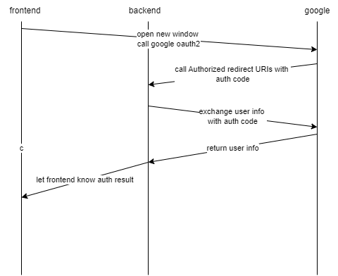

# Google Oauth2 login <Badge text="Google" type="warning" />
Design a google oauth2 login function that involved with frontend, backend and google

## Process flow and key steps

1. frontend open a new window and call google login with params client_id and redirect_uri (which is a backend api endpoint to receive auth result from google)
2. if user login valid by google, google will call the redirect_uri of backend, so backend will receive a temp code.
3. With that temp code, backend know user is authed and will call google with that code to fetch user info (optionally)
4. now backend will redirect to frontend page that only used to receive auth result, extract the info from url(optional), post a message and then close the window
5. on frontend login page, through event listener, capture the user info and navigate to home page.

## Things to notice
1. Literally, previous step 1 ~ 5 used one single request, which is redirect several times between frontend, backend and google. So the new window opened in step 1 is the same window closed at step 4.
2. remember to setup Authorized redirect URIs through google cloud. So only registered urls can be called by google after user login success.
3. also remember to register your frontend host address, so only login request from that address will get processed by google. you can setup a localhost for testing purpose, but remember to remove it after.
4. literally the whole process can be happened just between frontend and google if you store the google client_secret in frontend (potential security risk here).
5. When a page open a new window, that new window can communicate with its parent window using event listener and listen to 'message' field

## Key codes block
- communication between new opened window and login page with window.opener.postMessage and window.addEventListener
```js
// login page
const handleGoogleLogin = async () => {
  const googleClientId = import.meta.env.VITE_APP_GOOGLE_CLIENT_ID
  const redirectUri = import.meta.env.VITE_APP_GOOGLE_OAUTH_REDIRECT_URI
  const scope = encodeURIComponent('profile email')
  const authUrl = `https://accounts.google.com/o/oauth2/v2/auth?client_id=${googleClientId}&redirect_uri=${redirectUri}&response_type=code&scope=${scope}`
  window.open(authUrl, '_blank', 'width=500,height=600')
}

useEffect(() => {
  const handleOAuthCallback = async (event: MessageEvent) => {
    console.log('----event--', event)
    if (event.origin !== window.location.origin) {
      console.warn('untrusted origin', event.origin)
      return
    }
    const { status } = event.data
    if (status === 'success') {
      navigate('/')
    } else {
      console.error('login failed')
    }
  }

  window.addEventListener('message', handleOAuthCallback)

  // remove event listener using clean up function
  return () => {
    window.removeEventListener('message', handleOAuthCallback, false)
  }
}, [])

```

```js
// oauth result page
useEffect(() => {
  // might need to extract params like this:
  /*
  const params = new URLSearchParams(window.location.search)
  const token = params.get('token')
  const result = params.get('result')

  if (window.opener && result === 'success') {
    window.opener.postMessage(
      { token, status: 'success' },
      window.location.origin
    )
  }
  */
  if (window.opener) {
    window.opener.postMessage({ status: 'success' }, window.location.origin)
  }

  window.close()
}, [])
```

a little more details about `window.opener.postMessage`
- it allows a child window (popup) to send a message back to the parent window securely
- window.location.origin return the protocol, hostname and port of the current web page. So it's good practice to use it as target origin (second params send to window.opener.postMessage)
- always remember to validate the event origin.